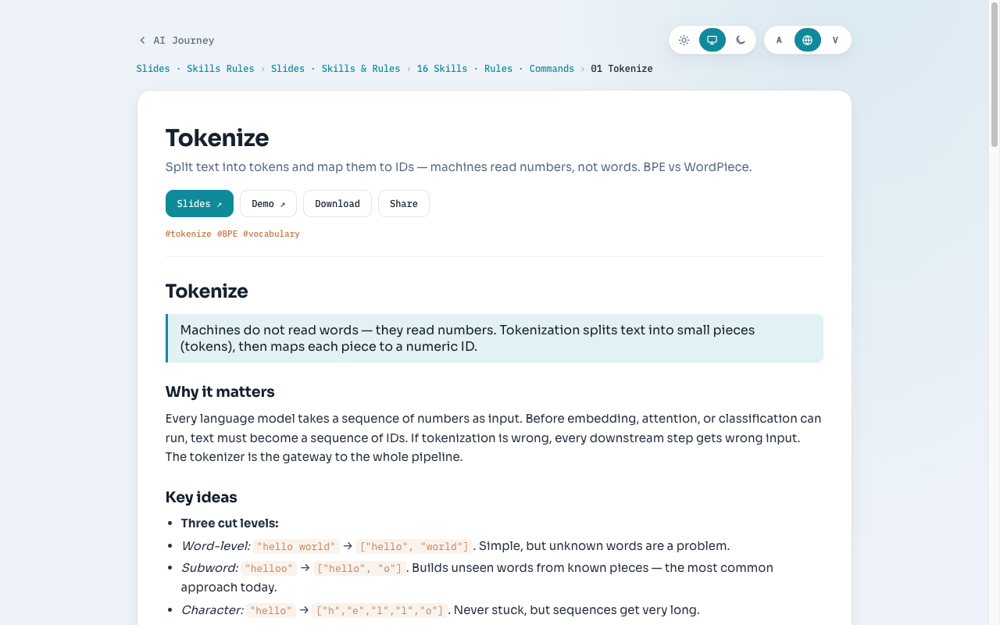
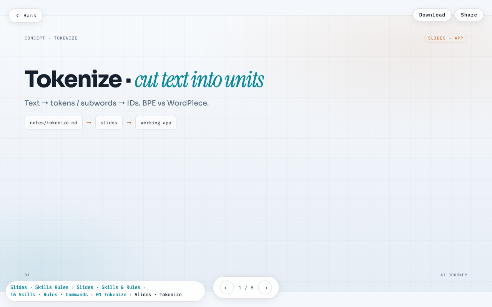
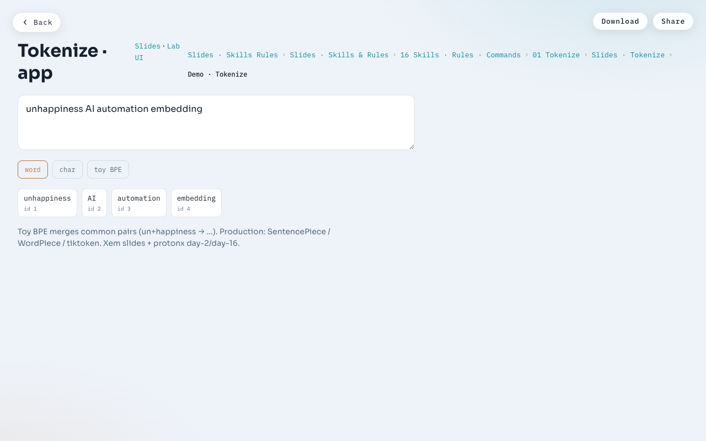
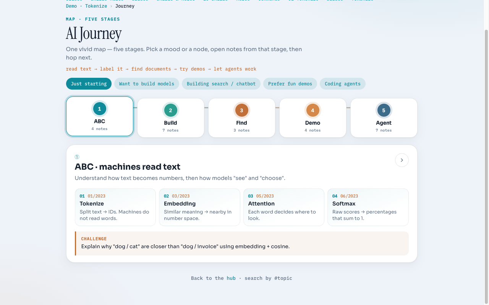

# AI Journey

A personal learning hub for common AI topics — from how machines read text to RAG, demos, and coding agents — all in one searchable site.

**Notes are the source of truth.** One build pipeline writes everything into `docs/` — open / serve only from there. Search is the hub focus. Theme and language default to **System**; Vietnamese is applied at runtime via a web translate API (no parallel files).

## Screenshots

| Notes                                     | Slides                                       |
| ----------------------------------------- | -------------------------------------------- |
|  |  |

| Demos                                         | Journey map                                           |
| --------------------------------------------- | ----------------------------------------------------- |
|  |  |

## Introduction

**AI Journey** collects the ideas you keep bumping into when building or learning AI — tokenize, embedding, attention, softmax, classification, training loops, RAG, vector search, MCP, skills/rules, and agent harnesses — and presents them as a single reviewable path instead of scattered notebooks and bookmarks.

Each topic has up to three layers:

| Layer     | What you get                                   |
| --------- | ---------------------------------------------- |
| **Note**  | Short English explanation — start here         |
| **Slide** | Step-by-step deck for re-lecture or presenting |
| **Demo**  | Browser app so you can *feel* the idea         |

A five-stage **Journey** map (`docs/journey.html`) ties the notes together:

1. **ABC** — machines read text (tokenize → embedding → attention → softmax)
2. **Build** — train and run (curve fitting, neural nets, classifiers, PyTorch/TF, HF/Kaggle)
3. **Find** — ground answers in documents (RAG → advanced query translation, vector DB, semantic search)
4. **Demo** — see it live (self-driving car, image gen, sentiment routing, train → infer)
5. **Agent** — steer the machine (patterns, LangGraph, LangSmith, MCP, skills, harnesses)

Open [`docs/index.html`](docs/index.html) after a build — search first, then dive into a note, slide, or demo.

## Three pillars (peers)

| Folder              | What       | Role                                                                                             |
| ------------------- | ---------- | ------------------------------------------------------------------------------------------------ |
| [`notes/`](notes)   | Markdown   | **Knowledge — source of truth.** One `.md` document per topic.                                   |
| [`slides/`](slides) | HTML decks | **Presentations.** One deck per topic at `slides/<topic>/index.html` (shared `slides/_shared/`). |
| [`demos/`](demos)   | HTML apps  | **Interactive apps.** Each topic under `demos/<topic>/app/` (shared `demos/_shared/`).           |

Plus a separate presentation: **Journey** (`docs/journey.html`) — a five-stage map over the notes (not itself a note).

A **note** is the center; it *may* point to a slide and a demo via [`notes/catalog.json`](notes/catalog.json) (`null` if missing).

```
notes/tokenize.md ──(catalog.json)──┬─→ slides/tokenize/index.html
                                    └─→ demos/tokenize/app/index.html
```

## Theme & language

On the hub, notes, and journey (icon toggles; both default to **System**):

- **Theme:** Light · System · Dark (saved in `localStorage`; System follows `prefers-color-scheme`)
- **Language:** EN · System · VI  
  - Source content is **English**  
  - **VI** = dynamic translation via web translate API in the browser (no second set of files)  
  - **System** follows the browser language (`vi*` → VI, otherwise EN)

## Build

After editing `notes/`, `catalog.json`, `slides/`, or `demos/`:

```bash
./scripts/build.sh
```

Rebuilds the hub, note pages, journey, copies demos/slides, and `search-index.json`.

## Review (GitHub Pages–like)

```bash
./scripts/review.sh
# → http://127.0.0.1:8080/ai-journey/docs/index.html
```

Options: `--port 9000`, `--no-build`, `--no-open`, `--base /ai-journey`.

Quick open without sub-path:

```bash
open docs/index.html
```

## Pipeline

```
notes/*.md + notes/catalog.json
slides/<topic>/index.html
demos/<topic>/app/index.html
        │
        ▼  ./scripts/build.sh
docs/                       # OUTPUT — only place to open / serve
  index.html                # search-first hub
  journey.html              # five-stage map (not a note)
  notes/<id>.html
  slides/**  demos/**
  search-index.json
```

Do not edit files under `docs/` by hand — they are build output.

## Edit content

1. Write / edit `notes/*.md` (**English**)
2. Optionally add `slides/<topic>/` and/or `demos/<topic>/app/`
3. Register in [`notes/catalog.json`](notes/catalog.json)
4. `./scripts/build.sh`
