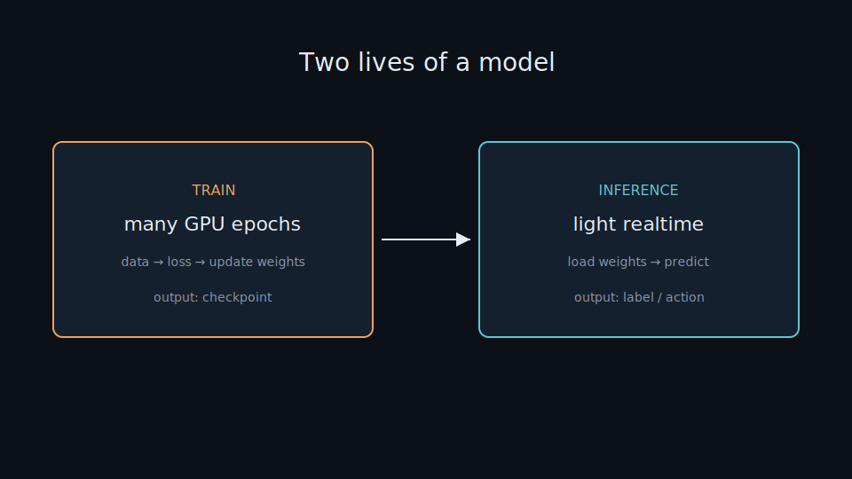

# Train → Inference

> Every model lives two lives: **learning** (train) — spend heavy compute once to adjust weights — and **using** (inference) — run lightly again and again to predict. Knowing the split clarifies what needs a GPU and what runs in the browser. Everyday metaphor: years at school (train) vs answering one exam question (infer).

## Why it matters

Beginners often treat “AI” as one block. Training (many GPU epochs) happens once to produce a checkpoint; inference (predict on new input) is what runs every time a user clicks. Lab demos are all inference — real training happens in notebooks / cloud GPU, then weights plug into the UI.

This mental model prevents two mistakes: (1) expecting a static HTML demo to “learn” from clicks, and (2) renting a GPU for every prediction when a CPU/GPU-light forward pass is enough.

## Key ideas

- **Two phases:**

  | Phase | Work | Cost | Output |
  |-------|------|------|--------|
  | **Train** | loop data for many epochs, compare prediction to label, update weights | heavy, needs GPU | checkpoint (weight file) |
  | **Inference** | load weights, feed input, get prediction | light, realtime | label / action |

- **Learning = reducing error:** each round the model predicts, measures loss (e.g. cross-entropy with [softmax.md](./softmax.md)), then nudges weights toward lower loss ([pytorch-training.md](./pytorch-training.md)).
- **Checkpoint is the product:** after training, save weights; inference no longer needs training data or labels.
- **Eval mode:** at inference, disable dropout / use running batch-norm stats (`model.eval()`, `torch.no_grad()`).
- **In AI Lab:** browser demos show *inference* only. Heavy training in protonx / Kaggle / Colab notebooks → export → embed in UI ([train-gpu.md](./train-gpu.md)).

## Worked example (intuition)

Car-nn: sensors → network → drive action. Weeks of notebook training produced `weights.json` (or similar). The demo loads those numbers and runs forward passes in the browser. Clicking “drive” never updates weights — that would be training, and it already happened.

## Common pitfalls

- **Confusing fine-tune with inference** — fine-tune is still training (updates weights).
- **Leaving dropout on at serve time** — noisy, inconsistent predictions.
- **Shipping the last epoch blindly** — prefer the best validation checkpoint.
- **Re-training from scratch when a Hub model + light fine-tune would do**.

## Illustrations




## Pipeline

```
data → train (many GPU epochs) → checkpoint → load → infer (predict)
```

## Slides & demo

| | Link |
|--|------|
| Slides | [slides/train-infer](../slides/train-infer/index.html) |
| Related demos | [car-nn](../demos/car-nn/app/index.html) · [sentiment](../demos/sentiment/app/index.html) |

## Related

- Full stack (PyTorch, TensorFlow, HF, Kaggle, GPU): [train-gpu.md](./train-gpu.md)
- Demo inference: [04-demo-car.md](./04-demo-car.md), [05-demo-text.md](./05-demo-text.md)
- [softmax.md](./softmax.md) — loss when training classifiers
- [pytorch-training.md](./pytorch-training.md), [tensorflow-training.md](./tensorflow-training.md)
