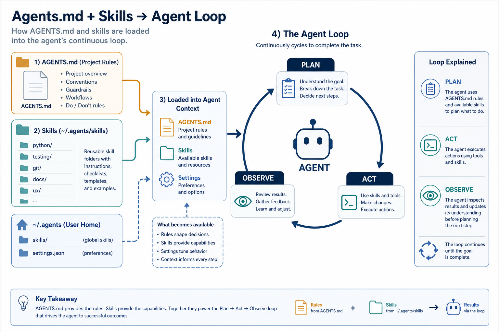

# AI Agents · Harness Comparison

> **Harness ≠ model.** Harness = orchestration software (UI, tool calling, context, agent loop). Model = the brain plugged in. The same model on different harnesses feels very different. Compare models at [08-model-notes.md](./08-model-notes.md). Everyday metaphor: the same chef in different kitchens — tools, mise en place, and service rhythm change the meal.

## Why it matters

Picking a model is only half the story. The harness decides what context the model sees, which tools it can call, and how it loops until the job is done. Two people with the same model in Cursor vs Claude Code can have opposite experiences — because the harness differs.

Understanding harnesses also explains why skills/rules/MCP feel uneven across clients: loading `~/.agents`, MCP reliability, and agent-loop design are harness features.

## Key ideas

- **Comparison table (personal experience):**

  | Harness | Strengths | Limitations | Feel |
  |---------|-----------|-------------|------|
  | **Cursor** | fast feedback — see results and adjust immediately; Auto vs fixed model; MCP + strong skills | Auto quality can be unpredictable | fastest loop; default `grok-4.5` is cheap with very good quality |
  | **Claude Code** | excellent at clarifying context; handles complex skills/rules well | slower; session limits → wait | solid for hard tasks / many constraints |
  | **Pi** | loads global `~/.agents`; lightweight | smaller ecosystem | same skills as Cursor/Claude, minimal overhead |
  | **Cline / Kilo** | open, customizable; Kilo clones Cline | quality depends on plugged-in model | good for rapid self-directed testing |
  | **OpenCode** | open source, many models | fewer “smart” features than Cursor | test models via OpenRouter |
  | **Zed** | fast editor, compact agent | agent less deep than Cursor/Claude | lightweight coding |

- **Harness axes (what actually differs):**

  | Axis | What it controls | Failure mode when weak |
  |------|------------------|------------------------|
  | **Context management** | which files/snippets enter the prompt; compression; @-mentions | model “forgets” repo facts or hallucinates APIs |
  | **Tool calling** | MCP, shell, browser, apply-patch reliability | suggests commands you must paste; can’t verify |
  | **Agent loop** | plan → act → observe → retry; tests; ask-back | one-shot answers; no self-correction |
  | **Skills / rules** | loading `~/.agents`, project rules, AGENTS.md | re-teaches conventions every session |
  | **Model routing** | Auto vs fixed; per-subagent models | quality swings mid-task without notice |
  | **Permissions / sandbox** | what the agent may write, network, secrets | either blocked forever or dangerously free |

  These axes explain “same model, different feel” better than brand marketing. See illustrations: model vs harness, and the agent loop fed by skills.

- **Auto vs fixed model:** Cursor Auto is fast but quality varies with routing. Fixed model (e.g. `grok-4.5`) is controllable — in practice often *better than Auto* without burning much budget (token efficiency? routing? worth investigating). Use Auto for trivial edits; pin a model when the task is long or must be reproducible.

- **First mate:** orchestrates crew + `agents.md` — an agent that knows what to do and coordinates crewmates. Lab UI: Kun Chen video + repo `kunchenguid/firstmate`. Multi-agent setups only help if the harness can pass tools and shared context cleanly.

- **Homes:** `~/.agents/skills` (global skills), `~/work-station/agents-setup` (skill trials), `graphify` (codebase link viz). Write skills once; expect harnesses to differ in *how reliably* they auto-trigger them ([skills-rules.md](./skills-rules.md)).

## Worked example (intuition)

Same bug report: “tests fail on CI.”

1. **Cursor + MCP + repo skills:** agent runs the test command, reads the log artifact, opens the failing file, patches, re-runs locally, summarizes the fix. You stay in the loop as reviewer.
2. **Claude Code on a hard multi-file failure:** slower turnaround, but stronger at asking clarifying questions (“is this flake or deterministic?”) and respecting complex rules/skills before editing.
3. **Thin harness (weak shell/MCP):** model *describes* `pytest -q` and a possible patch; you paste and run. Same brain; missing arms on the tool-calling and agent-loop axes.
4. **Lesson:** before swapping models, check whether the harness can execute, observe, and iterate. Model upgrades cannot fix a missing terminal.

## Common pitfalls

- **Blaming the model for harness gaps** — missing tools ≠ weak reasoning.
- **Always using Auto** — convenience can hide routing regressions.
- **Skipping AGENTS.md / skills** — every session re-teaches the same project facts.
- **Comparing harnesses on different tasks** — hard refactors favor Claude Code; tight UI loops favor Cursor.
- **Ignoring permission prompts** — denying shell/MCP turns a capable harness into a chatbot.

## Illustrations

## Deeper dive

- **Context is a scarce budget:** harnesses that aggressively summarize or drop files will make even Opus look lost. Prefer harnesses that let you pin paths (`@file`) for critical contracts (schemas, AGENTS.md). Measure by “did it edit the right module?” not by eloquence.
- **Tool calling reliability > tool count:** one solid shell + apply-patch beats ten flaky MCP servers. Debug MCP with a tiny `list_tools` / ping before blaming the model for “not using tools.”
- **Agent loop depth:** look for re-run-after-test, screenshot/browser verify, and ask-back when requirements are ambiguous. One-shot “here’s a patch” is a thin loop; plan→act→observe→retry is a thick one.
- **Skills as harness fuel:** a skill only helps if the client loads `~/.agents` (or project skills) and the model reads descriptions. Pi/Cursor/Claude differ here — see [skills-rules.md](./skills-rules.md). Duplicate skill trees across clients cause drift.
- **Routing transparency:** Auto that silently switches mid-task breaks reproducibility. For long refactors, pin the model and note it in the PR description.
- **Multi-agent / first-mate patterns:** worth it when subtasks are isolatable (explore vs edit vs review). Wasteful when the harness can’t share a single filesystem truth — then you get conflicting patches.
- **Security axis:** harnesses that auto-approve network and secret reads feel fast until they leak. Prefer explicit approvals for prod credentials; keep `.env` out of prompts.
- **Observability of the loop.** Prefer harnesses that show tool calls, command output, and which model ran. Without that trace, “quality feels worse today” is undebuggable — could be routing, MCP, or context drop.
- **Bootstrap checklist for a new harness:** (1) can it see the repo, (2) can it run a test, (3) can it apply a patch, (4) does it load `~/.agents` / AGENTS.md. Fail any one and fix that before A/B testing models.

## Decision guide

| Situation | Prefer | Avoid / why |
|-----------|--------|-------------|
| Tight UI / edit loop, need to see diffs instantly | Cursor + fixed strong cheap model (e.g. Grok 4.5) | Thin chat-only harness — you’ll paste commands forever |
| Hard multi-constraint refactor, dense skills/rules | Claude Code | Comparing it to Cursor on a 30-second CSS tweak |
| Same skills across clients, minimal UI | Pi loading `~/.agents` | Copying skill trees into each vendor folder |
| Testing many OpenRouter models quickly | OpenCode / Cline-style open harness | Judging model quality inside a broken tool setup |
| “Model is dumb today” but shell/MCP denied | Fix harness permissions / MCP health | Immediately swapping to a bigger model |
| Reproducible long task | Pin model + AGENTS.md + skills | Auto routing with no log of which model ran |

## Case study

Same bug report — “CI tests fail” — across three harness thicknesses.

- **Inputs:** failing CI log, local repo, MCP/shell permissions, project skills + AGENTS.md.
- **Steps:** **Thick (Cursor):** run tests → read log → patch → re-run → summarize. **Claude Code:** slower, stronger ask-back on flake vs deterministic failure before editing. **Thin chat:** model only *describes* `pytest -q`; you paste everything.
- **Output:** thick harnesses produce a verified fix; thin harnesses produce advice. Model card unchanged.
- **What you'd check:** shell/MCP not denied; skills actually loaded; Auto vs pinned model logged; don’t swap to a bigger model until the harness can execute and observe.

## Lab checklist

- [ ] Pick two harnesses and run the same small repo task on both
- [ ] Deny shell once on purpose; note how the session degrades to chatbot mode
- [ ] Pin a model vs Auto on a multi-step task; record which felt more stable
- [ ] Confirm `~/.agents` or project skills are visible to the client you use
- [ ] Add or update AGENTS.md with one non-negotiable project convention
- [ ] Trace one agent loop: plan → tool call → observe → retry
- [ ] Debug one MCP server with a tiny ping/`list_tools` before blaming the model
- [ ] Write which harness axis failed last time you “blamed the model”

## Slides & demo

| | Link |
|--|------|
| Slides | [slides/agents](../slides/agents/index.html) |
| MCP demo | [demos/mcp](../demos/mcp/app/index.html) |
| Complexity router | [demos/complexity-router](../demos/complexity-router/app/index.html) |

## References

- [AGENTS.md](https://agents.md/) — standard for declaring agent instructions
- [Cursor docs](https://docs.cursor.com/) · [Claude Code](https://docs.anthropic.com/en/docs/claude-code)

## Related

- [mcp.md](./mcp.md), [skills-rules.md](./skills-rules.md), [08-model-notes.md](./08-model-notes.md)
