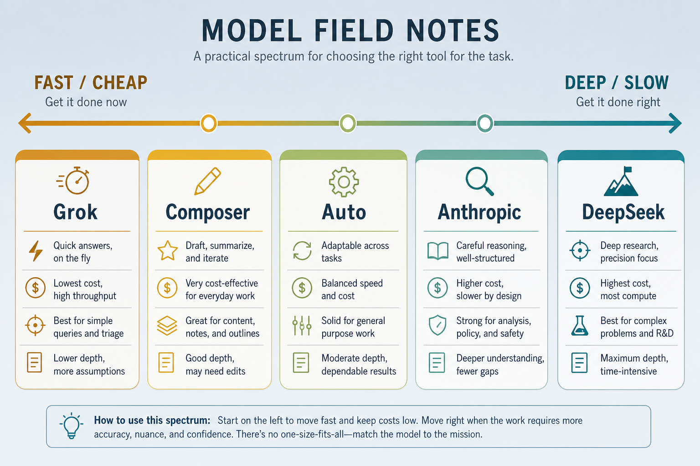
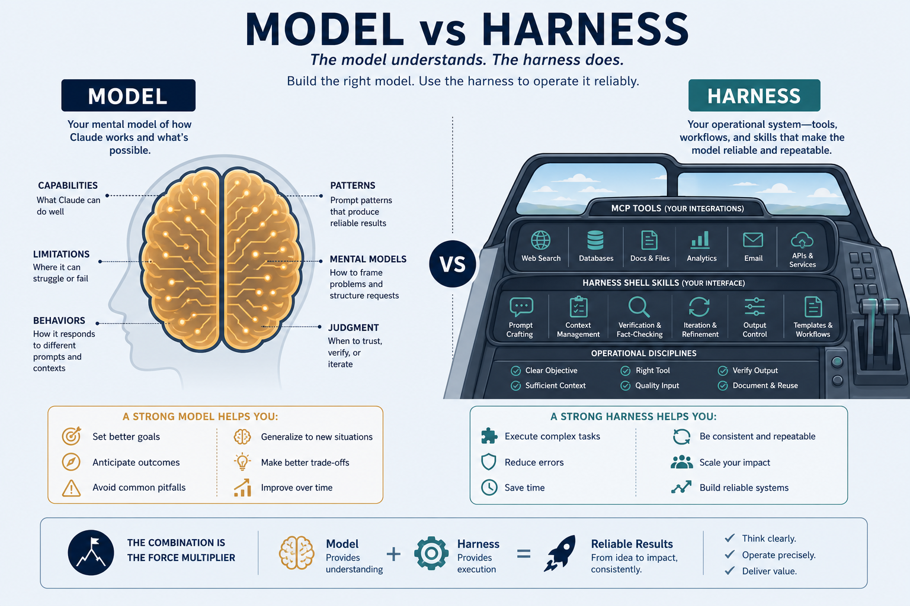

# Model field notes

> **Model ≠ harness.** Notes on *the models themselves* (via OpenRouter + Cursor). Compare harnesses at [07-agents.md](./07-agents.md). Everyday metaphor: engines (models) vs cars (harnesses) — swap engines carefully; don’t blame the engine for a missing steering wheel.

## Why it matters

Harness choice shapes daily workflow; model choice shapes reasoning quality, speed, and cost. These are personal field notes — not benchmarks — on what each model feels like in real coding work.

Use them as a starting map: greenfield vs debug, image needs, and budget change the winner.

## Key ideas

- **Quick table (personal experience):**

  | Model / mode | Strong | Weak / cost |
  |--------------|--------|-------------|
  | **Grok 4.5** | fast, smooth, high quality; moderate spend | not top on every benchmark; more hallucination on unverifiable tasks |
  | **Composer 2.5 Fast** | very fast, good replies | costs more than Auto |
  | **Cursor Auto** | fast feedback loop | quality varies with routing |
  | **Anthropic Opus / Sonnet / Fable** | best at clarifying context and skills; reliable interaction | slow; session limits |
  | **DeepSeek V4** | strong debug / fix on existing code | no images; weaker on greenfield |
  | **Qwen 3** | simple tasks | weak on complex following / describing large projects without codebase |
  | **Kimi / GLM** | good code | expensive |

- **Grok 4.5 — why it impresses:** fast, smooth, genuinely good — especially as Cursor default; does not burn much budget yet often beats Auto. Public context (xAI, mid-2026): optimized for coding + agentic at ~**80 TPS**; ~**4.2× fewer output tokens** than Opus 4.8 on SWE-Bench Pro → much cheaper per task ($2 in / $6 out per 1M). Benchmarks competitive with Opus 4.8 / GPT-5.5 on many coding evals; trained with Cursor. Main edge = **intelligence per unit time and cost** on verifiable tasks.

- **Principles:**
  - *Greenfield* (new project, thin codebase): favor strong reasoning (Anthropic, Grok) over DeepSeek/Qwen.
  - *Debug / fix on existing code:* DeepSeek V4 is effective and cheap.
  - *Needs images (screenshots, diagrams):* avoid DeepSeek (no image input).
  - *Speed + low cost:* Grok 4.5 / Composer Fast.
  - *Clarifying constraints and skill design:* Anthropic strongest at asking back.

- **Re-check prices:** OpenRouter and vendor pages move — treat $ numbers as snapshots, not eternal truth.

## Worked example (intuition)

Task A: “Scaffold a new notes-first docs site.” → Grok or Anthropic (greenfield + structure).  
Task B: “This failing pytest, repo already large.” → DeepSeek V4 or Grok (local reasoning + cheap iteration).  
Task C: “Read this screenshot of the broken UI.” → not DeepSeek; pick a vision-capable model.

## Common pitfalls

- **One model for every job** — waste money or quality.
- **Trusting marketing TPS without task fit** — fast wrong answers still waste time.
- **Ignoring image capability** — vision tasks silently degrade.
- **Confusing Auto routing with a single model’s skill**.

## Illustrations

## Slides & demo

| | Link |
|--|------|
| Slides | [slides/model-notes](../slides/model-notes/index.html) |

## References

- [OpenRouter — models & prices](https://openrouter.ai/models)
- [LMArena leaderboard](https://lmarena.ai/) — ranked by human votes

## Related

- [07-agents.md](./07-agents.md), [mcp.md](./mcp.md), [skills-rules.md](./skills-rules.md), [personal-knowledge-base.md](./personal-knowledge-base.md)
