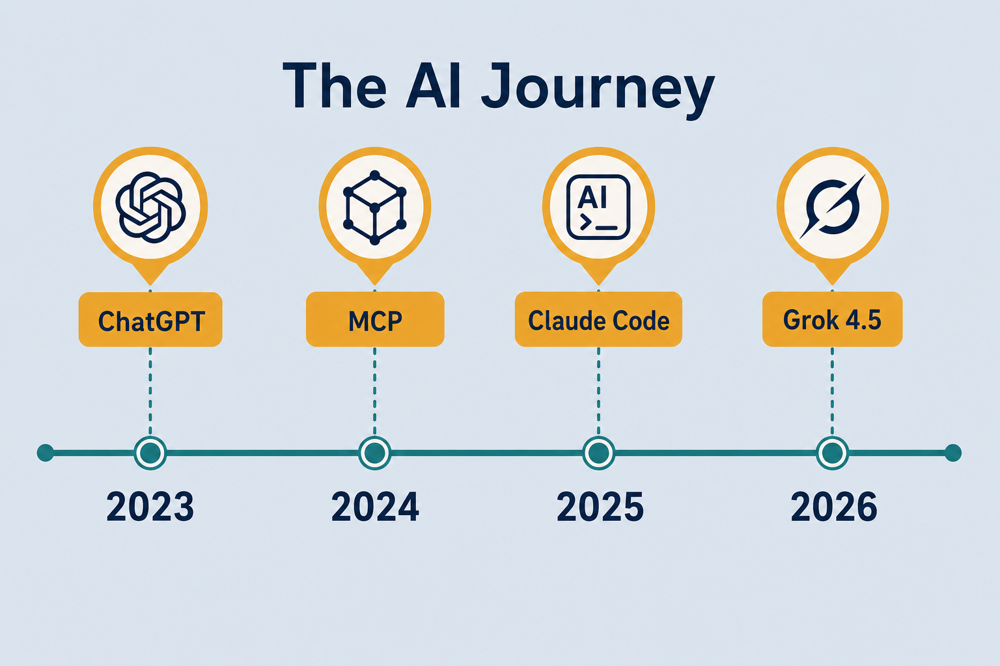
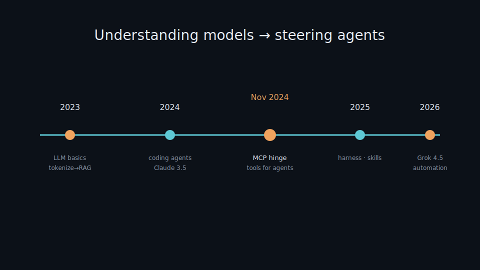
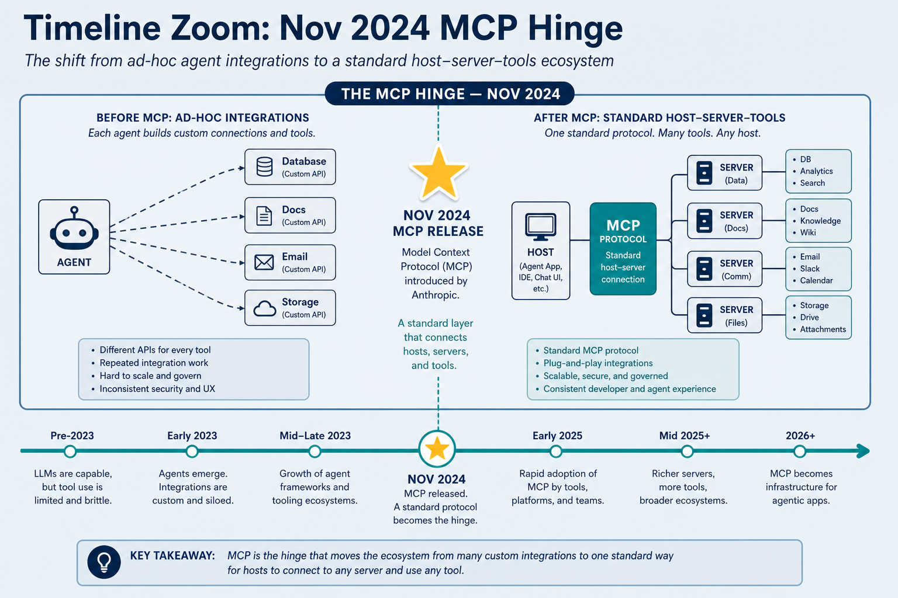

# AI Timeline — My Journey (2023 → Present)

> Starting point: **2023** — first time learning about LLMs, then background concepts (tokenize, embedding, attention, softmax, RAG). This timeline anchors lab notes to real AI milestones and shows why focus now shifts to **agents / automation**.

> Academic roots (Transformer 2017, BERT 2018, GPT-3 2020) underpin the concepts — see [attention.md](./attention.md), [embedding.md](./embedding.md). *My journey* starts in 2023.

## Why it matters

Concepts and tools arrive in an order that made sense for me. Mapping that order against industry milestones explains why the lab went from fundamentals → RAG → agents — and which older notes still matter.

You can enter the lab at any stage, but the timeline shows *why* MCP and harness notes sit on top of tokenize/attention rather than replacing them.

## Key ideas

- **Stage 1 — 2023: first LLM exposure and foundations**
  - Late 2022 **ChatGPT (GPT-3.5)** made AI mainstream → 2023 I started learning seriously.
  - **March 2023** — GPT-4 · Claude 1 · Llama 1; RAG exploded.
  - Learned in order: [tokenize.md](./tokenize.md) → [embedding.md](./embedding.md) → [attention.md](./attention.md) → [softmax.md](./softmax.md).
  - Then retrieval: [rag.md](./rag.md); train → infer: [06-train-infer.md](./06-train-infer.md), [train-gpu.md](./train-gpu.md).
  - **July 2023** — Claude 2 · Llama 2. **December 2023** — Gemini 1.0 · Mixtral (MoE open).
  - **Stage takeaway:** without tokenization, vectors, and attention, later “agent” talk is vocabulary without mechanisms. Build the substrate first.

- **Stage 2 — 2024: stronger models + early coding agents**
  - Gemini 1.5 (1M context) · Claude 3 → 3.5 Sonnet (coding jump — Cursor took off) · GPT-4o · Llama 3.1 405B · o1 · DeepSeek V3.
  - Shift from *reading concepts* to *using AI to code for real*.
  - **Stage takeaway:** long context and coding-specialized models made “pair programmer” practical. The bottleneck moved from “can the model code?” toward “can I steer it in a repo?”

- **Stage 3 — late 2024–2025: agent era (MCP · skills · harness)**
  - Lab pivots to **MCP · skills · harness**.
  - **November 25, 2024** — **MCP** (Anthropic): standard agent ↔ tool connection. **Hinge** between chatbots and tool-using agents. See [mcp.md](./mcp.md).
  - **January 2025** — DeepSeek R1 — [08-model-notes.md](./08-model-notes.md).
  - **February 2025** — Claude 3.7 Sonnet · GPT-4.5. **March 2025** — MCP Streamable HTTP + OAuth · Gemini 2.5 Pro.
  - **May 2025** — Claude 4 → **Claude Code** as strong harness: [07-agents.md](./07-agents.md).
  - **August 2025** — GPT-5. **November 2025** — Claude Opus 4.5 · **AGENTS.md** standard · skills/rules: [skills-rules.md](./skills-rules.md).
  - **Stage takeaway:** after MCP, progress is less “new chat UI” and more **tools + loop + portable instructions**. Harness quality starts to matter as much as model IQ.

- **Stage 4 — 2026: model wave + automation (now)**
  - Focus: [08-model-notes.md](./08-model-notes.md), [09-agent-automation.md](./09-agent-automation.md).
  - **April 2026** — GPT-5.5. **May 28, 2026** — Claude Opus 4.8. **June 2026** — Claude Fable 5 · Sonnet 5.
  - **July 8, 2026** — **Grok 4.5** (trained with Cursor): fast, token-efficient, cheap. **July 9, 2026** — GPT-5.6.
  - Parallel: **OpenClaw** (`pi` harness) opens “agent controls everything” → **Hermess** polishes it.
  - **Stage takeaway:** model waves are frequent; keep field notes fresh, but keep pipelines (RAG, train/infer, MCP) stable. Automation (OpenClaw / Hermess) asks: what should run without a human in the loop?

- **Milestone table:**

  | When | Event | In the lab |
  |------|-------|------------|
  | **2023** | first LLM exposure (ChatGPT/GPT-4) | start studying |
  | March 2023 | GPT-4, Claude 1, Llama 1 | tokenize · embedding · attention · softmax · RAG |
  | 2024 | Gemini 1.5, Claude 3.5, GPT-4o, o1 | coding agents |
  | **Nov 2024** | **MCP launches** | mcp (hinge) |
  | 2025 | Claude 4 / GPT-5 / R1 · AGENTS.md | harness, skills |
  | 2026 | Grok 4.5, Opus 4.8, GPT-5.6 | model notes, automation |

- **Takeaways (compressed):** journey goes from **understanding models** (2023–2024) → **steering agents** (late 2024 onward). MCP (November 2024) is the hinge. 2023 concepts are not outdated — tokenize / attention / RAG still underpin every agent. Watch harnesses (Cursor / Claude Code / pi), model waves (Grok 4.5…), automation (OpenClaw / Hermess).

## Worked example (how to use this note)

**Path A — new to the lab:** follow Stage 1 order (tokenize → embedding → attention → softmax → RAG → train/infer). Only then open MCP / agents. When something breaks in an agent app, you will recognize “bad retrieve” or “bad tokenize” instead of blaming the harness.

**Path B — already building agents:** start at [mcp.md](./mcp.md) + [skills-rules.md](./skills-rules.md) + [07-agents.md](./07-agents.md), but keep Stage 1 notes as the substrate. Example: agent “can’t find docs” → check embedding/RAG notes before swapping models.

**Path C — catching up on 2026:** skim Stage 4 + [08-model-notes.md](./08-model-notes.md) / [09-agent-automation.md](./09-agent-automation.md), then decide whether your bottleneck is **model**, **harness**, or **automation scope** — the timeline’s point is that these are different layers.

**MCP hinge check:** if your stack still treats tools as one-off plugins with no shared protocol, you are pre-hinge mentally — read [mcp.md](./mcp.md) even if your editor already “has tools.”

## Common pitfalls

- **Skipping foundations because “agents are the new thing”** — bad retrieve / bad tokenize still break agent apps.
- **Treating every model launch as a full rewrite** — update field notes; keep pipelines stable.
- **Timeline as dogma** — this is *my* path; yours may start at RAG or harnesses.
- **Collapsing model vs harness vs automation into one upgrade** — swap one layer at a time.

## Illustrations

## Deeper dive

- **Why Nov 25, 2024 is the hinge:** before MCP, every product reinvented tool schemas. After MCP, skills/harnesses can share a connector language — lab notes shift from “how does GPT work?” to “how does the agent get arms?” ([mcp.md](./mcp.md)).
- **Foundations still fire in agent bugs:** wrong chunking → bad RAG → confident wrong tool args. Attention/softmax notes explain *why* prompts and logits behave; they are not nostalgia.
- **Coding-agent jump (2024):** Claude 3.5 + Cursor made repo-native edit loops mainstream. That prepared the ground for harness comparison in 2025 — once everyone could code with AI, *orchestration* became the differentiator ([07-agents.md](./07-agents.md)).
- **Skills / AGENTS.md (late 2025):** portable instructions reduce re-prompting. They sit *above* models: same skill file, different brains ([skills-rules.md](./skills-rules.md)).
- **2026 model wave discipline:** Grok 4.5 / Opus 4.8 / GPT-5.6 arrive close together — update [08-model-notes.md](./08-model-notes.md), don’t rewrite RAG or train pipelines for each launch.
- **Automation layer:** OpenClaw → Hermess is about *unattended* loops. Ask what must stay human-approved (prod deploys, secrets) vs what can run on a schedule ([09-agent-automation.md](./09-agent-automation.md)).
- **How to read industry news with this timeline:** classify each headline as foundation science, model release, protocol/harness, or automation product — then open the matching lab note instead of doomscrolling.
- **Layered upgrade discipline.** When something breaks after a “new model” week, ask which layer moved: weights, harness, protocol, or automation scope. Changing two layers at once makes root cause impossible.
- **Personal milestone markers.** Add *your* dates beside industry ones (first RAG demo, first MCP server, first unattended job). The note becomes a learning journal, not only a news scrapbook.

## Decision guide

| Situation | Prefer | Avoid / why |
|-----------|--------|-------------|
| Brand new to LLMs | Stage 1 path (tokenize → … → RAG) | Jumping straight to multi-agent automation — no substrate |
| Shipping tool-using agents | MCP + skills + harness notes (Stage 3) | Treating ChatGPT plugins as “done” without a protocol story |
| “Which model this week?” | Update [08-model-notes.md](./08-model-notes.md); pin for the task | Rewriting the whole lab stack per launch |
| Agent fails on retrieval-heavy tasks | Revisit embedding / RAG / semantic-search notes | Only swapping to a bigger chat model |
| Want unattended runs | [09-agent-automation.md](./09-agent-automation.md) + clear approvals | Giving a harness prod credentials “to try OpenClaw” |
| Confused model vs harness pain | Read [07-agents.md](./07-agents.md) axes first | Blaming Grok/Opus for missing shell/MCP |

## Case study

Use the timeline to diagnose “our agent can’t find the docs” in a 2026 stack.

- **Inputs:** tool-using coding agent, RAG over internal markdown, recent model upgrade, MCP-enabled editor.
- **Steps:** classify the failure — retrieval (Stage 1: embedding/RAG/semantic-search) vs tool protocol (Stage 3: MCP) vs harness loop (Stage 3: permissions/skills) vs model choice (Stage 4). Check chunking/index freshness before swapping Grok↔Opus. Confirm MCP tools actually list and run. Only then tune model field notes.
- **Output:** fix is usually reindex + correct embedding model, or MCP auth — not a full rewrite for the latest LLM launch.
- **What you'd check:** Nov 2024 hinge literacy (shared tool protocol); foundations still linked from agent bugs; one layer changed at a time; automation (OpenClaw/Hermess) not given prod secrets “to try.”

## Lab checklist

- [ ] Walk Stage 1 notes in order (tokenize → embedding → attention → softmax → RAG) once
- [ ] Mark which stage you are *actually* working in this week
- [ ] Read [mcp.md](./mcp.md) and state in one sentence why Nov 2024 is a hinge
- [ ] Open harness vs model notes and label your last pain as one or the other
- [ ] Add two personal dates to the milestone table (your firsts)
- [ ] Pick a news headline and classify it: science / model / protocol / automation
- [ ] For one agent bug, name the foundation note that would explain it
- [ ] List what must stay human-approved before any unattended automation

## Slides & demo

| | Link |
|--|------|
| Slides | [slides/ai-timeline](../slides/ai-timeline/index.html) |
| Related | [Hermess slides](../slides/hermess/index.html) |

## Related

- [07-agents.md](./07-agents.md), [08-model-notes.md](./08-model-notes.md), [09-agent-automation.md](./09-agent-automation.md), [mcp.md](./mcp.md)
- Foundations: [tokenize.md](./tokenize.md), [embedding.md](./embedding.md), [attention.md](./attention.md), [rag.md](./rag.md)
