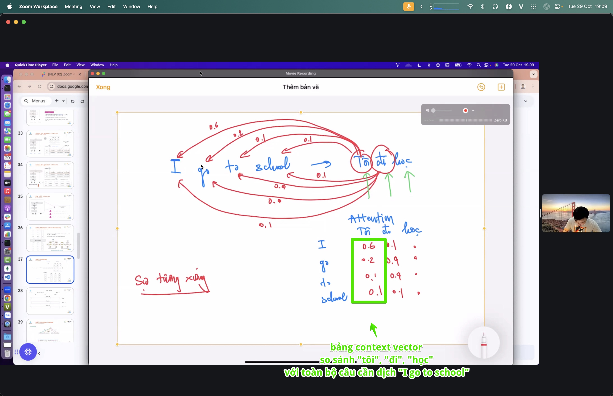

# Attention

> Khi đọc một từ, nên "nhìn" sang những từ nào khác để hiểu đúng? Attention là cơ chế cho mô hình tự quyết định điều đó.

## Vì sao quan trọng

Trong câu "con **chó** đuổi con mèo vì **nó** đói", chữ "nó" chỉ ai? Người đọc tự nối "nó" với "chó". Attention cho phép mỗi từ nhìn khắp câu và tự gán trọng số: từ nào liên quan thì chú ý nhiều, từ nào không thì bỏ qua. Đây là ý tưởng lõi làm nên Transformer — kiến trúc đứng sau gần như mọi mô hình ngôn ngữ hiện đại.

## Ý chính

- **Q, K, V — ba vai của mỗi từ:**
  - *Query (Q)*: "tôi đang cần thông tin gì?"
  - *Key (K)*: "tôi có thể cung cấp thông tin gì?"
  - *Value (V)*: "nội dung thực sự tôi mang theo."
  - So Q của từ này với K của mọi từ → ra điểm liên quan → trộn V theo điểm đó.
- **Điểm liên quan → softmax → trung bình có trọng số:** điểm thô đi qua [softmax.md](./softmax.md) thành các trọng số cộng lại bằng 1, rồi lấy tổng V theo trọng số.
- **Self-attention vs cross-attention:** self = các từ trong *cùng một câu* nhìn nhau; cross = câu này nhìn sang câu/nguồn khác (vd dịch máy: câu đích nhìn câu nguồn).
- **Multi-head = nhiều góc nhìn song song:** một "đầu" bắt quan hệ ngữ pháp, đầu khác bắt quan hệ chủ đề… rồi gộp lại.

## Hình minh họa





## Trong pipeline

```
vectors (embedding) → [attention: Q·K → softmax → ×V] → biểu diễn giàu ngữ cảnh
```

Attention đứng ngay sau [embedding.md](./embedding.md) và dùng [softmax.md](./softmax.md) để chuẩn hóa trọng số.

## Slides & demo

| | Link |
|--|------|
| Slides | [slides/attention](../slides/attention/index.html) |
| Working app | [demos/attention/app](../demos/attention/app/index.html) |

## Tham khảo

- Vaswani et al. 2017 — [Attention Is All You Need](https://arxiv.org/abs/1706.03762)
- Jay Alammar — [The Illustrated Transformer](https://jalammar.github.io/illustrated-transformer/)

## Related

- [softmax.md](./softmax.md), [embedding.md](./embedding.md)
