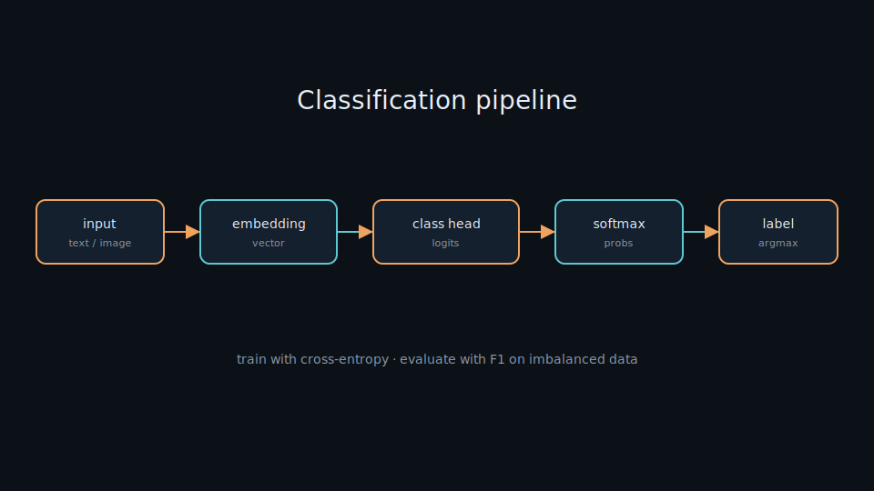
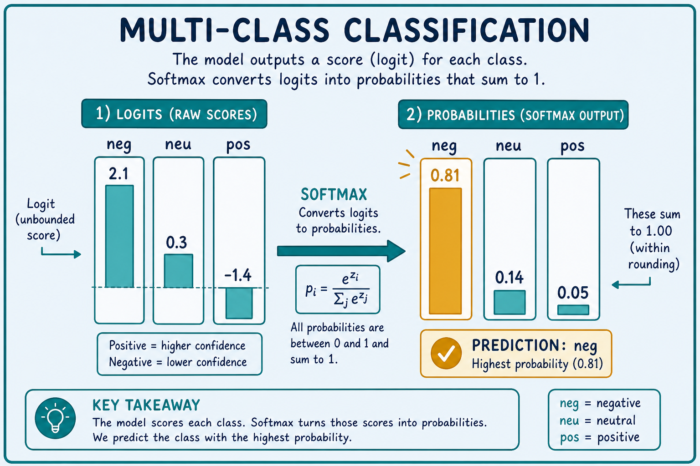
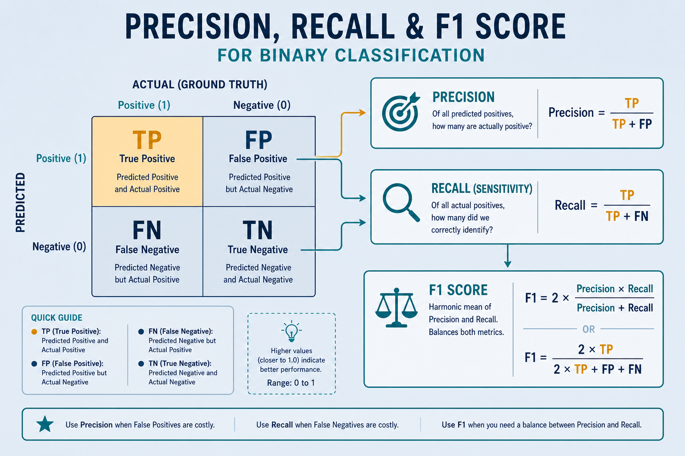
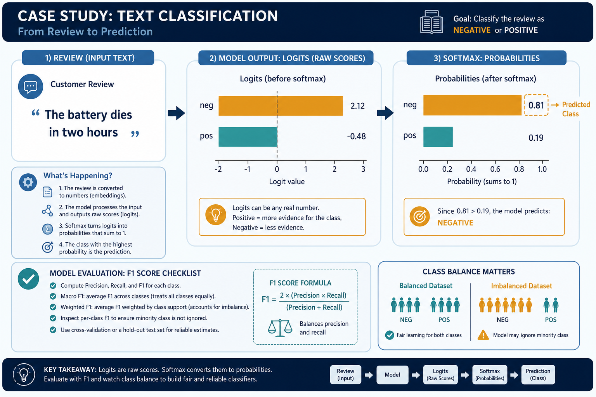

# Classification — Label The Input

> Given an input (text, image, numbers), the model picks one label from a fixed set. Everyday example: a review arrives → the model says *positive*, *neutral*, or *negative*. This is the most common “build a model” problem — right after [softmax](./softmax.md).

## Why it matters

Much practical work is categorization: is this review positive or negative, is the email spam, is the photo a dog or a cat, is the question easy or hard. Understanding classification is understanding how a model makes **discrete decisions** — and it reuses the same tokenize → embedding → softmax chain the lab walks through.

If you can train a solid classifier, you already understand loss, evaluation, and the train/infer split that every larger system (RAG routers, sentiment demos, self-driving-car) depends on.

## Key ideas

- **Classification head:** the last layer turns a representation (vector) into a score per label (*logits*), then [softmax](./softmax.md) converts to probabilities → pick the highest (`argmax`). For a *d*-dim embedding and *C* classes, the head is typically `W ∈ ℝ^{C×d}` plus bias: `logits = Wx + b`.
- **Binary vs multi-class vs multi-label:**
  - *Binary:* two classes (spam / not spam). Often one logit + sigmoid, or two logits + softmax.
  - *Multi-class:* pick **exactly one** of many (neg / neu / pos). Softmax + cross-entropy.
  - *Multi-label:* one input can carry several labels at once (e.g. a news article tagged *politics* and *economy*). Usually independent sigmoids + binary cross-entropy per label.
- **Training loss:** *cross-entropy* measures how wrong the predicted probability is versus the true label; training pushes loss down ([06-train-infer.md](./06-train-infer.md)). For true class *y*, multi-class CE is `−log p_y` (natural log); if the model assigns `p_y = 0.81`, loss ≈ `0.21`, and if `p_y = 0.05`, loss ≈ `3.0` — wrong and confident is expensive.
- **Evaluation beyond accuracy:** accuracy is easy but misleading on imbalanced data. Also check **precision**, **recall**, and **F1**. For rare classes (fraud, rare diseases), recall often matters more than overall accuracy. Formulas: `precision = TP/(TP+FP)`, `recall = TP/(TP+FN)`, `F1 = 2·P·R/(P+R)`.
- **Class balance:** rare labels are easily ignored — the model can get 95% accuracy by always predicting the majority class. Always inspect the label distribution before trusting a score. Mitigations: class weights in the loss, oversample the rare class, or report *macro*-F1 (average F1 per class) instead of micro/accuracy.
- **Calibration vs ranking:** a model can rank classes correctly (`argmax` right) while probabilities are miscalibrated (e.g. “90%” when it is only right 70% of the time). For thresholded decisions or risk scores, check calibration (reliability diagrams) or use temperature scaling on a validation set.

## Worked example

Input sentence: `"The battery dies in two hours."`

1. Tokenize → IDs → embedding → (optional Transformer) → one vector for the sentence.
2. Classification head → logits, e.g. `[2.1, 0.3, −1.4]` for `{neg, neu, pos}`.
3. Softmax → probabilities ≈ `[0.81, 0.14, 0.05]` (computed as `e^{2.1} / (e^{2.1}+e^{0.3}+e^{−1.4}) ≈ 8.17 / 10.08`).
4. Prediction = **neg**. During training, if the true label is `neg`, cross-entropy is `−log(0.81) ≈ 0.21`; if the true label were `pos`, loss would be `−log(0.05) ≈ 3.0` and gradients would push the pos logit up and the others down.

Confusion-matrix sketch for a tiny val set of 100 reviews (true → predicted): say 40 true-neg with 36 correct, 30 true-neu with 20 correct, 30 true-pos with 25 correct → overall accuracy 81%, but neu recall is only `20/30 ≈ 0.67` — the class you should dig into next.

## Common pitfalls

- **Wrong metric on skewed data** — report F1 / per-class recall, not only accuracy.
- **Train/val leakage** — same review appearing in both splits → fake high scores.
- **Label noise** — inconsistent human labels cap how good the model can get.
- **Threshold blindness** — for binary tasks, the default 0.5 cutoff may be wrong; tune on validation.
- **Macro vs micro F1 mix-up** — micro-F1 tracks overall correctness; macro-F1 treats rare classes as equal — pick the one that matches the product goal.

## Illustrations









## Deeper dive

- **Logits are unbounded; probabilities are not.** Softmax never outputs exact 0 or 1 in floating point, but near-zero probs still produce huge CE when the true class is missed. Clipping logits or using label smoothing (`ε ≈ 0.1`) softens targets to `(1−ε)` on the true class and `ε/(C−1)` elsewhere — often improves calibration on small datasets.
- **Binary: one logit + sigmoid vs two logits + softmax.** Mathematically related: a single logit *z* with sigmoid equals a two-class softmax with logits `[0, z]` up to a constant. Prefer one logit + `BCEWithLogitsLoss` / `binary_crossentropy(from_logits=True)` for binary; prefer *C* logits + CE for multi-class — fewer footguns than hand-rolling sigmoid on multi-class.
- **Imbalance math.** With 95% majority / 5% minority, always-predict-majority accuracy is 0.95 while minority recall is 0. Weighted CE multiplies the rare-class term by `N / (C · n_c)` (sklearn-style `balanced`). Compare: unweighted CE may sit at ~0.2 with useless minority recall; weighted CE raises train loss but lifts minority F1.
- **Multi-label ≠ multi-class.** Softmax forces probabilities to sum to 1 (mutually exclusive). Multi-label needs independent sigmoids so *politics* and *economy* can both be high. Failure mode: applying softmax to multi-label tags collapses co-occurring labels.
- **Thresholds and operating points.** For binary spam, lower the threshold (e.g. 0.3 instead of 0.5) to raise recall at the cost of precision. Plot a precision–recall curve on validation; pick the point that matches cost (false negative vs false positive).
- **Head-only vs full fine-tune.** Freeze the encoder and train only the classification head when you have &lt;1k labels or little GPU — fast, less overfitting. Unfreeze top Transformer layers (or full model with small LR `2e-5`) when you have more data and need domain shift.
- **Failure modes to expect.** (1) Confidence on OOD inputs (out-of-vocab slang, new product names) stays high — add an abstain / “unknown” path. (2) Label schema drift (3-class → 5-class) invalidates the old head. (3) Metric hacking: optimizing accuracy while the product needs per-class recall.
- **Confusion-matrix triage order.** When overall accuracy looks fine, sort classes by recall ascending and inspect the worst row first — that is usually where label noise, class imbalance, or a too-aggressive threshold hides. Fix one class schema issue before retuning the whole LR.
- **Softmax temperature at serve time.** Temperature `T > 1` flattens probs (better calibration / softer thresholds); `T < 1` sharpens (more confident argmax). Apply only after training; retuning `T` on validation is cheaper than full retrain when the ranking is already good.

## Decision guide

| Situation | Prefer | Avoid / why |
|-----------|--------|-------------|
| Exactly one label from many (sentiment, intent) | Softmax + sparse CE; report accuracy *and* macro-F1 | Sigmoid-per-class without care — probs won’t form a proper distribution |
| Tags can co-occur (topics, attributes) | Independent sigmoid + BCE per label | Softmax — forces mutual exclusion |
| Rare positive class (fraud, defect) | Recall / PR-AUC; class weights or oversampling | Accuracy alone — majority baseline looks “good” |
| Need a deployable cutoff (spam filter) | Tune threshold on val PR curve | Fixed 0.5 — rarely matches business cost |
| &lt;1k labeled examples, strong pretrained encoder | Freeze backbone, train head (or LoRA) | Full scratch train — overfits and wastes compute |
| Probabilities used as risk scores | Check calibration; temperature scale if needed | Trusting raw softmax as true probability |



## Case study

Support-ticket triage for a SaaS inbox with three intents: `billing`, `bug`, `how-to` (~12 000 labeled tickets, ~70% how-to).

- **Inputs:** ticket subject + body (truncated to 256 tokens), integer labels `0..2`, stratified 80/10/10 split; class weights ≈ `[1.4, 2.1, 0.7]` because bugs are rare.
- **Steps:** load a small Hub encoder → freeze backbone for 2 epochs (head LR `1e-3`) → unfreeze with AdamW `2e-5` for 3 more → early-stop on **macro-F1** (not accuracy).
- **Output:** checkpoint with val macro-F1 ≈ 0.78, accuracy ≈ 0.88; confusion matrix shows `bug` recall ≈ 0.71 — still the weak class.
- **What you'd check:** (1) majority baseline accuracy (~0.70) so 0.88 is real lift; (2) per-class recall, especially `bug`; (3) no duplicate ticket IDs across splits; (4) threshold / abstain for low-max-prob tickets before routing to humans.

## Lab checklist

- [ ] Plot the label histogram and write down the majority-class accuracy baseline
- [ ] Train a tiny head-only classifier, then compare macro-F1 vs accuracy on the same val set
- [ ] Build a 3×3 confusion matrix and identify the worst-recall class
- [ ] Sweep a binary threshold (or max-prob abstain) and record precision/recall at two operating points
- [ ] Induce label noise on 5% of train labels and measure how much val F1 drops
- [ ] Export the best-val checkpoint and re-run inference with `eval()` / no-grad only
- [ ] Document which metric you would ship on (accuracy vs macro-F1) and why

## Pipeline

```
input → embedding → classification head → softmax → label
                                    (train: cross-entropy)
```

Classification is the destination of [softmax.md](./softmax.md); train it with [pytorch-training.md](./pytorch-training.md) or [tensorflow-training.md](./tensorflow-training.md). See it live in [05-demo-text.md](./05-demo-text.md) and [self-driving-car.md](./self-driving-car.md).

## Slides & demo

| | Link |
|--|------|
| Slides | [slides/classification](../slides/classification/index.html) |
| Related demos | [sentiment](../demos/sentiment/app/index.html) · [self-driving-car](../demos/self-driving-car/app/index.html) |

## References

- [scikit-learn — classification](https://scikit-learn.org/stable/supervised_learning.html)
- Google — [Classification (ML Crash Course)](https://developers.google.com/machine-learning/crash-course/classification/video-lecture)

## Related

- [softmax.md](./softmax.md), [05-demo-text.md](./05-demo-text.md), [self-driving-car.md](./self-driving-car.md)
- [pytorch-training.md](./pytorch-training.md), [tensorflow-training.md](./tensorflow-training.md)
