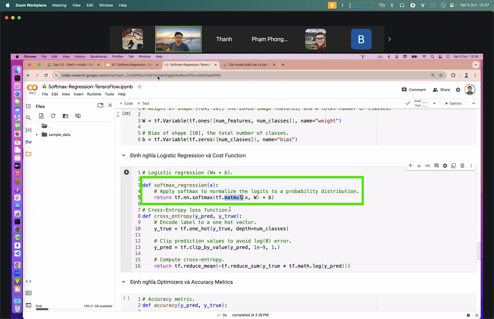
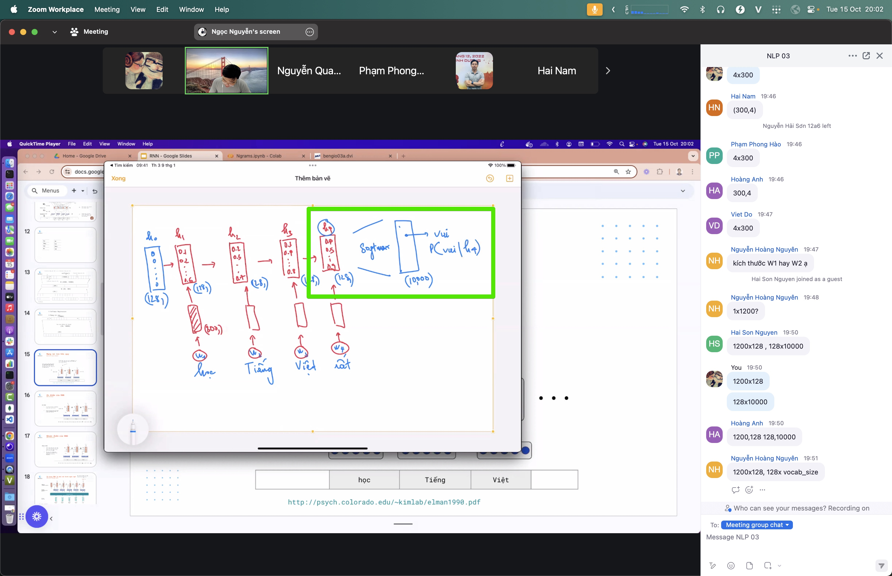
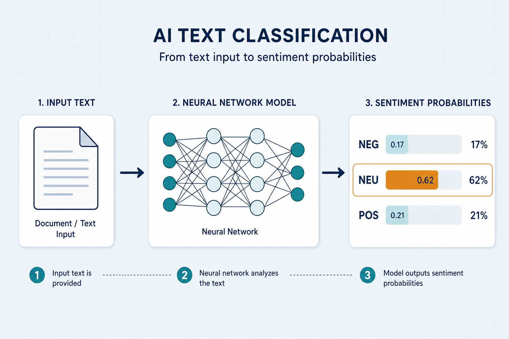

# Classification — label the input

> Given an input (text, image, numbers), the model picks one label from a fixed set. Everyday example: a review arrives → the model says *positive*, *neutral*, or *negative*. This is the most common “build a model” problem — right after [softmax](./softmax.md).

## Why it matters

Much practical work is categorization: is this review positive or negative, is the email spam, is the photo a dog or a cat, is the question easy or hard. Understanding classification is understanding how a model makes **discrete decisions** — and it reuses the same tokenize → embedding → softmax chain the lab walks through.

If you can train a solid classifier, you already understand loss, evaluation, and the train/infer split that every larger system (RAG routers, sentiment demos, car-nn) depends on.

## Key ideas

- **Classification head:** the last layer turns a representation (vector) into a score per label (*logits*), then [softmax](./softmax.md) converts to probabilities → pick the highest (`argmax`).
- **Binary vs multi-class vs multi-label:**
  - *Binary:* two classes (spam / not spam). Often one logit + sigmoid, or two logits + softmax.
  - *Multi-class:* pick **exactly one** of many (neg / neu / pos). Softmax + cross-entropy.
  - *Multi-label:* one input can carry several labels at once (e.g. a news article tagged *politics* and *economy*). Usually independent sigmoids + binary cross-entropy per label.
- **Training loss:** *cross-entropy* measures how wrong the predicted probability is versus the true label; training pushes loss down ([06-train-infer.md](./06-train-infer.md)).
- **Evaluation beyond accuracy:** accuracy is easy but misleading on imbalanced data. Also check **precision**, **recall**, and **F1**. For rare classes (fraud, rare diseases), recall often matters more than overall accuracy.
- **Class balance:** rare labels are easily ignored — the model can get 95% accuracy by always predicting the majority class. Always inspect the label distribution before trusting a score.

## Worked example

Input sentence: `"The battery dies in two hours."`

1. Tokenize → IDs → embedding → (optional Transformer) → one vector for the sentence.
2. Classification head → logits, e.g. `[2.1, 0.3, −1.4]` for `{neg, neu, pos}`.
3. Softmax → probabilities ≈ `[0.81, 0.14, 0.05]`.
4. Prediction = **neg**. During training, if the true label is `neg`, cross-entropy is low; if the true label were `pos`, loss would be high and weights would update.

## Common pitfalls

- **Wrong metric on skewed data** — report F1 / per-class recall, not only accuracy.
- **Train/val leakage** — same review appearing in both splits → fake high scores.
- **Label noise** — inconsistent human labels cap how good the model can get.
- **Threshold blindness** — for binary tasks, the default 0.5 cutoff may be wrong; tune on validation.

## Illustrations








## Pipeline

```
input → embedding → classification head → softmax → label
                                    (train: cross-entropy)
```

Classification is the destination of [softmax.md](./softmax.md); train it with [pytorch-training.md](./pytorch-training.md) or [tensorflow-training.md](./tensorflow-training.md). See it live in [05-demo-text.md](./05-demo-text.md) and [04-demo-car.md](./04-demo-car.md).

## Slides & demo

| | Link |
|--|------|
| Slides | [slides/classification](../slides/classification/index.html) |
| Related demos | [sentiment](../demos/sentiment/app/index.html) · [car-nn](../demos/car-nn/app/index.html) |

## References

- [scikit-learn — classification](https://scikit-learn.org/stable/supervised_learning.html)
- Google — [Classification (ML Crash Course)](https://developers.google.com/machine-learning/crash-course/classification/video-lecture)

## Related

- [softmax.md](./softmax.md), [05-demo-text.md](./05-demo-text.md), [04-demo-car.md](./04-demo-car.md)
- [pytorch-training.md](./pytorch-training.md), [tensorflow-training.md](./tensorflow-training.md)
