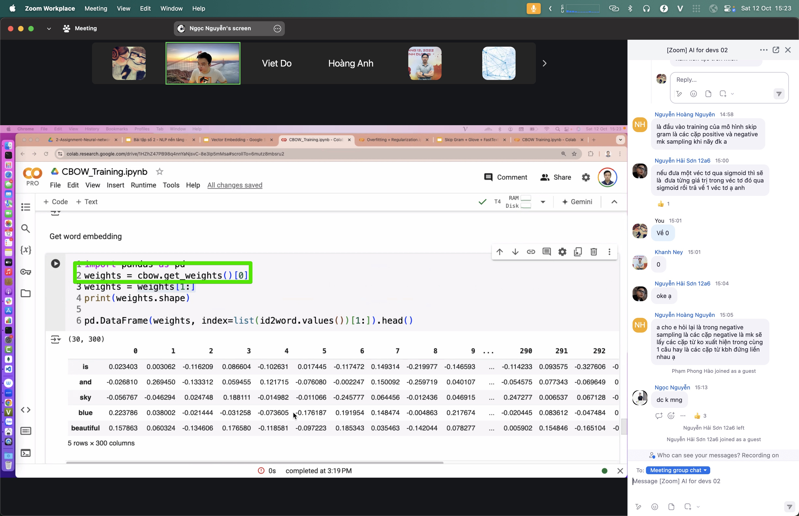

# Embedding

> Turn each token ID into a vector — a list of numbers. The key idea: things *close in meaning* sit *close together* in that number space.

## Why it matters

An ID is just a label: `dog = 812`, `cat = 4471` — whether those numbers are near or far means nothing. Embedding replaces each ID with a learned vector so "dog" and "cat" (both pets) land close together, while "dog" and "invoice" land far apart. That lets the machine measure semantic similarity — the foundation of semantic search, classification, and RAG.

## Key ideas

- **Vector = meaning coordinates:** each token or sentence is a point in high-dimensional space (often 300–1536 dimensions). Similar meaning → nearby points.
- **Learn from context:** models like CBOW/Word2Vec learn vectors by predicting words from their neighbors. "You are known by the company you keep."
- **Cosine similarity:** compare the *direction* of two vectors, not their length. Same direction → cosine ≈ 1 (very similar); perpendicular → ≈ 0.
- **Cosine or dot product?** Cosine normalizes length — good when you care about topic, not strength. Dot product also weights vector magnitude.
- **Not just text:** images, audio, users — anything can be embedded and compared in the same space.

## Illustrations





## Pipeline

```
IDs → [embedding] → vectors → { classification | attention | top-k for RAG }
```

Embedding takes output from [tokenize.md](./tokenize.md) and powers both [attention.md](./attention.md) and [rag.md](./rag.md).

## Slides & demo

| | Link |
|--|------|
| Slides | [slides/embedding](../slides/embedding/index.html) |
| Working app | [demos/embedding/app](../demos/embedding/app/index.html) |

## References

- Google — [Machine Learning Crash Course: Embeddings](https://developers.google.com/machine-learning/crash-course/embeddings)
- Mikolov et al. 2013 — [Word2Vec](https://arxiv.org/abs/1301.3781)

## Related

- [tokenize.md](./tokenize.md), [rag.md](./rag.md), [05-demo-text.md](./05-demo-text.md)
