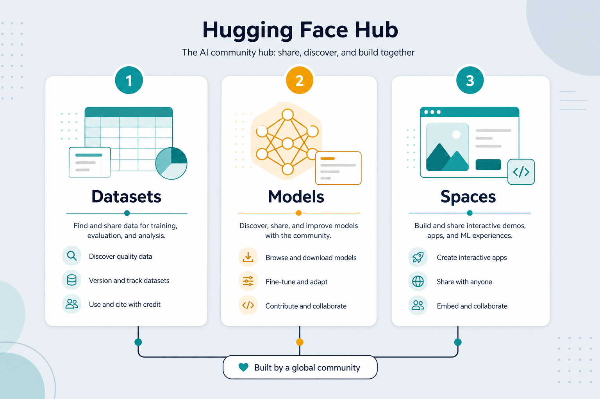

# Hugging Face — dataset + Space → usable model

> “GitHub for AI”: get **datasets**, **pretrained models**, and host demos with **Spaces**. Shortens the path from idea to a model you can actually use. Everyday metaphor: don’t forge steel — borrow a good knife, sharpen it on your wood, then show others how it cuts.

## Why it matters

Training from scratch is expensive. Hugging Face lets you stand on others’ work: download a labeled dataset, grab a pretrained model, fine-tune lightly, and deploy a demo in minutes. It is the fastest route from [training](./pytorch-training.md) to a shareable model.

For the lab, HF is also where sentence-transformers models, tokenizer cards, and many RAG embedding checkpoints live.

## Key ideas

- **Three main pieces:**
  - *Datasets* — labeled data, often one line: `load_dataset("imdb")`.
  - *Models (Hub)* — pretrained BERT, GPT, ViT, MiniLM, etc.; fine-tune instead of training from zero.
  - *Spaces* — host demo apps (Gradio/Streamlit), with optional GPU, plus a simple API endpoint.
- **`transformers` + `datasets`:** a few lines to load model, tokenizer, and data; fine-tune with `Trainer` or a familiar PyTorch/TF loop.
- **Fine-tune beats scratch:** leverage knowledge from large models → needs far less data and time. A few thousand labeled examples often beat a huge scratch train.
- **Spaces = demo + endpoint:** push a model to a Space → instant UI and API for others to try.
- **Model card and license:** read license, intended use, and limitations before commercial use. Some weights are research-only.
- **Tokenizer must match the model:** always load the tokenizer that belongs to that checkpoint — mismatch corrupts every ID ([tokenize.md](./tokenize.md)).
- **Output is a model:** checkpoint or endpoint ready for [inference](./06-train-infer.md).

## Typical path

```python
from datasets import load_dataset
from transformers import AutoTokenizer, AutoModelForSequenceClassification, Trainer

ds = load_dataset("imdb")
tok = AutoTokenizer.from_pretrained("bert-base-uncased")
model = AutoModelForSequenceClassification.from_pretrained("bert-base-uncased", num_labels=2)
# tokenize, Trainer(...).train(), then model.push_to_hub("my-imdb-clf")
```

## Worked example (intuition)

Want a Vietnamese sentiment demo? Search the Hub for a multilingual or vi checkpoint → load a small labeled set → fine-tune 2–3 epochs on a free GPU ([kaggle.md](./kaggle.md) / Colab) → push to a Space. You never trained a Transformer from random weights.

## Common pitfalls

- **Ignoring the model card** — wrong license or unsafe intended use.
- **Tokenizer mismatch** — using a different vocab than the checkpoint.
- **Fine-tuning the whole giant model when LoRA would do** — wasted GPU and money for small tasks.
- **Eval on the Hub’s test split after peeking** — keep a private holdout.

## Illustrations



## Pipeline

```
HF Datasets → pretrained model (Hub) → fine-tune (PyTorch/TF) → push to Hub / Spaces → use
```

Hugging Face is the data source and runtime partner for [pytorch-training.md](./pytorch-training.md) / [tensorflow-training.md](./tensorflow-training.md); for competition-style data and free GPU, see [kaggle.md](./kaggle.md).

## Slides & demo

| | Link |
|--|------|
| Slides | [slides/huggingface](../slides/huggingface/index.html) |

## References

- [Hugging Face Hub](https://huggingface.co/docs/hub/) · [Datasets](https://huggingface.co/docs/datasets/) · [Spaces](https://huggingface.co/docs/hub/spaces)
- [transformers](https://huggingface.co/docs/transformers/)

## Related

- [pytorch-training.md](./pytorch-training.md), [tensorflow-training.md](./tensorflow-training.md)
- [kaggle.md](./kaggle.md), [sentence-transformers.md](./sentence-transformers.md), [train-gpu.md](./train-gpu.md)
