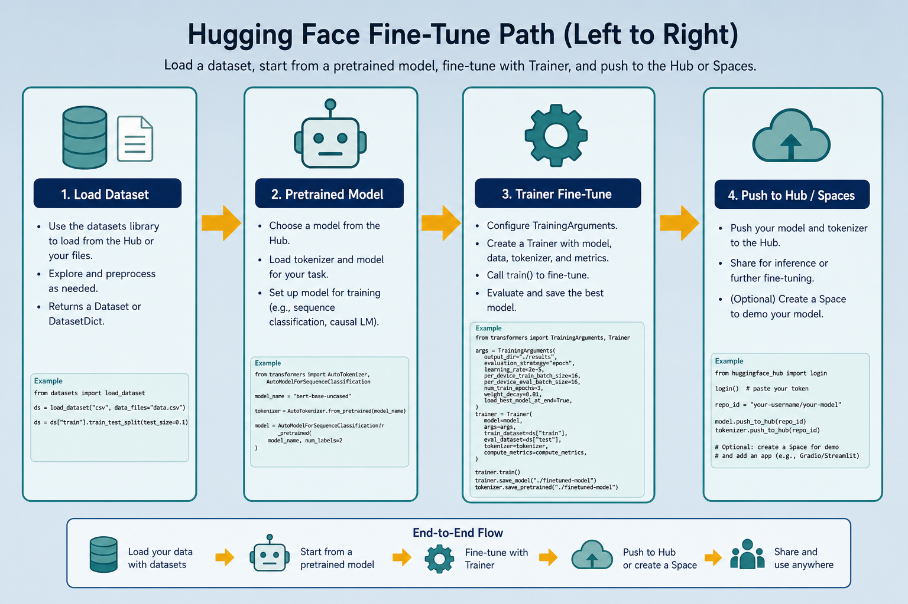

# Hugging Face — Dataset + Space → Usable Model

> “GitHub for AI”: get **datasets**, **pretrained models**, and host demos with **Spaces**. Shortens the path from idea to a model you can actually use. Everyday metaphor: don’t forge steel — borrow a good knife, sharpen it on your wood, then show others how it cuts.

## Why it matters

Training from scratch is expensive. Hugging Face lets you stand on others’ work: download a labeled dataset, grab a pretrained model, fine-tune lightly, and deploy a demo in minutes. It is the fastest route from [training](./pytorch-training.md) to a shareable model.

For the lab, HF is also where sentence-transformers models, tokenizer cards, and many RAG embedding checkpoints live.

## Key ideas

- **Three main pieces:**
  - *Datasets* — labeled data, often one line: `load_dataset("imdb")`.
  - *Models (Hub)* — pretrained BERT, GPT, ViT, MiniLM, etc.; fine-tune instead of training from zero.
  - *Spaces* — host demo apps (Gradio/Streamlit), with optional GPU, plus a simple API endpoint.
- **`transformers` + `datasets`:** a few lines to load model, tokenizer, and data; fine-tune with `Trainer` or a familiar PyTorch/TF loop. Typical APIs: `AutoTokenizer`, `AutoModelForSequenceClassification`, `TrainingArguments`, `Trainer`.
- **Fine-tune beats scratch:** leverage knowledge from large models → needs far less data and time. A few thousand labeled examples often beat a huge scratch train. Rough scale: full BERT-base pretraining is ~110M params on billions of tokens; your fine-tune may use 2k–50k labels and finish in minutes–hours on one GPU.
- **Spaces = demo + endpoint:** push a model to a Space → instant UI and API for others to try.
- **Model card and license:** read license, intended use, and limitations before commercial use. Some weights are research-only (e.g. restrictive RAIL or non-commercial clauses).
- **Tokenizer must match the model:** always load the tokenizer that belongs to that checkpoint — mismatch corrupts every ID ([tokenize.md](./tokenize.md)). Same `from_pretrained("org/name")` string for both.
- **Output is a model:** checkpoint or endpoint ready for [inference](./06-train-infer.md). Prefer `model.push_to_hub(...)` + `tokenizer.push_to_hub(...)` so consumers get a matched pair.
- **Task head swap:** `AutoModelForSequenceClassification.from_pretrained(..., num_labels=C)` replaces the pretrained LM head with a fresh *C*-way classifier — those new weights need enough steps to learn; the encoder starts strong.

## Typical path

```python
from datasets import load_dataset
from transformers import AutoTokenizer, AutoModelForSequenceClassification, Trainer

ds = load_dataset("imdb")
tok = AutoTokenizer.from_pretrained("bert-base-uncased")
model = AutoModelForSequenceClassification.from_pretrained("bert-base-uncased", num_labels=2)
# tokenize, Trainer(...).train(), then model.push_to_hub("my-imdb-clf")
```

## Worked example (intuition)

Want a Vietnamese sentiment demo? Search the Hub for a multilingual or vi checkpoint → load a small labeled set → fine-tune 2–3 epochs on a free GPU ([kaggle.md](./kaggle.md) / Colab) → push to a Space. You never trained a Transformer from random weights.

Concrete path: `load_dataset("imdb")` → ~25k train reviews → tokenize with `max_length=256`, `truncation=True` → `TrainingArguments(learning_rate=2e-5, per_device_train_batch_size=16, num_train_epochs=3, evaluation_strategy="epoch")` → `Trainer.train()`. Expect ~ few thousand optimizer steps; val accuracy often jumps from ~50% (random binary) to mid–high 80s/%90s depending on model size — then `push_to_hub` and wrap with Gradio on a Space.

## Common pitfalls

- **Ignoring the model card** — wrong license or unsafe intended use.
- **Tokenizer mismatch** — using a different vocab than the checkpoint.
- **Fine-tuning the whole giant model when LoRA would do** — wasted GPU and money for small tasks.
- **Eval on the Hub’s test split after peeking** — keep a private holdout.
- **Wrong `num_labels`** — loading a 2-class head onto a 5-class problem (or vice versa) silently mis-shapes the classifier.
- **Forgetting `padding` / dynamic padding** — slow training or shape errors; use a data collator (`DataCollatorWithPadding`) with the tokenizer.

## Illustrations




## Deeper dive

- **`Auto*` classes resolve configs from the Hub.** `from_pretrained("bert-base-uncased")` downloads `config.json`, weights, and vocab. Pin a revision (`revision="abc123"`) for reproducibility — `main` can move. Offline later: `local_files_only=True` after the first cache hit under `~/.cache/huggingface/`.
- **Trainer vs raw PyTorch.** `Trainer` handles device placement, eval loops, logging, and Hub upload. Raw loop wins when you need custom sampling or multi-loss. Mini comparison: Trainer ≈ Keras `fit` for Transformers; raw loop ≈ full PyTorch control ([pytorch-training.md](./pytorch-training.md)).
- **Full fine-tune vs LoRA / PEFT.** Full update: all ~110M BERT params, highest quality ceiling, most VRAM. LoRA: train low-rank adapters (`r=8`, `α=16` typical) — often &lt;1% trainable params, fits smaller GPUs, easy to swap task heads. Prefer LoRA when data is small or you host many task variants.
- **Learning rates that work.** Encoder fine-tunes: `2e-5`–`5e-5` with AdamW + linear warmup (~6% of steps). Classification head-only: you can use higher LR (`1e-3`) on the head while freezing the body. Too-high LR on the whole stack → catastrophic forgetting (val falls below the zero-shot baseline).
- **Dataset map and cache.** `ds.map(tokenize, batched=True)` caches tokenized Arrow tables. Failure mode: changing the tokenize function but reusing a stale cache — pass a new `cache_file_name` or `load_from_cache_file=False` when debugging.
- **Spaces runtime.** Free CPU Spaces are fine for tiny models; GPU Spaces cost quota. Gradio `Interface` can call `pipeline("sentiment-analysis", model="you/model")`. Cold starts and sleep on free tiers — not an SLA. For production, export ONNX/TorchScript or host your own endpoint.
- **Safety and cards.** Check `license`, `datasets` used for training, and bias notes. Gated models need `huggingface-cli login` + accepting terms. Shipping without reading the card is a legal/product risk, not just a style issue.
- **Eval during Trainer.** Set `evaluation_strategy="epoch"` (or steps) and `load_best_model_at_end=True` with `metric_for_best_model` — otherwise `train()` happily returns the last overfit weights even when logs showed a better midpoint.
- **Hub as the glue.** Treat `push_to_hub` of *model + tokenizer + a tiny model card* as the end of training, not “weights somewhere on disk.” Consumers (Spaces, classmates, demos) should clone one repo id, not three mismatched folders.

## Decision guide

| Situation | Prefer | Avoid / why |
|-----------|--------|-------------|
| Standard text classification fine-tune | `AutoModelForSequenceClassification` + `Trainer` | Training BERT from random init — needs huge data/compute |
| &lt;5k labels or tight VRAM | LoRA / PEFT or freeze encoder + train head | Full 7B fine-tune “because bigger” |
| Shareable demo for classmates | Gradio Space pointing at your Hub model | Only a local notebook nobody can open |
| Reproducible paper / course hand-in | Pin `revision` + save `TrainingArguments` | Floating `main` tags that change under you |
| Embeddings for RAG / search | [sentence-transformers](./sentence-transformers.md) models on the Hub | Raw LM CLS without pooling/normalization |
| Commercial product | Models with clear commercial license + private holdout eval | Research-only weights; Hub test set as your only metric |

## Case study

Ship a binary IMDb sentiment classifier from Hub assets to a Gradio Space in one afternoon.

- **Inputs:** `load_dataset("imdb")` (~25k train), `bert-base-uncased` tokenizer + `AutoModelForSequenceClassification(..., num_labels=2)`, `max_length=256`.
- **Steps:** map tokenize with padding/truncation → `TrainingArguments(lr=2e-5, batch=16, epochs=3, eval each epoch, load_best_model_at_end)` → `Trainer.train()` on a free GPU → `push_to_hub("you/imdb-clf")` → Space wraps `pipeline("sentiment-analysis", model="you/imdb-clf")`.
- **Output:** val accuracy typically mid–high 80s to ~90%; Hub repo contains `config.json`, weights, and tokenizer; Space URL is the shareable demo.
- **What you'd check:** model card license allows your use; tokenizer files are present beside weights; private holdout (not only Hub test peek); Space cold-start still returns a label after wake.

## Lab checklist

- [ ] Load a Hub dataset and print split sizes + one labeled example
- [ ] Load matching `AutoTokenizer` + task model from the same checkpoint id
- [ ] Fine-tune with `Trainer` for ≥1 epoch and log a val metric
- [ ] Enable `load_best_model_at_end` (or manually save best) before export
- [ ] Push model *and* tokenizer to a Hub repo (or save a complete local folder)
- [ ] Read the model card license and intended-use section before sharing
- [ ] Call the model via `pipeline` or a tiny Gradio UI once
- [ ] (Optional) Retry the same fine-tune with LoRA and compare VRAM / quality

## Pipeline

```
HF Datasets → pretrained model (Hub) → fine-tune (PyTorch/TF) → push to Hub / Spaces → use
```

Hugging Face is the data source and runtime partner for [pytorch-training.md](./pytorch-training.md) / [tensorflow-training.md](./tensorflow-training.md); for competition-style data and free GPU, see [kaggle.md](./kaggle.md).

## Slides & demo

| | Link |
|--|------|
| Slides | [slides/huggingface](../slides/huggingface/index.html) |

## References

- [Hugging Face Hub](https://huggingface.co/docs/hub/) · [Datasets](https://huggingface.co/docs/datasets/) · [Spaces](https://huggingface.co/docs/hub/spaces)
- [transformers](https://huggingface.co/docs/transformers/)

## Related

- [pytorch-training.md](./pytorch-training.md), [tensorflow-training.md](./tensorflow-training.md)
- [kaggle.md](./kaggle.md), [sentence-transformers.md](./sentence-transformers.md), [train-gpu.md](./train-gpu.md)
