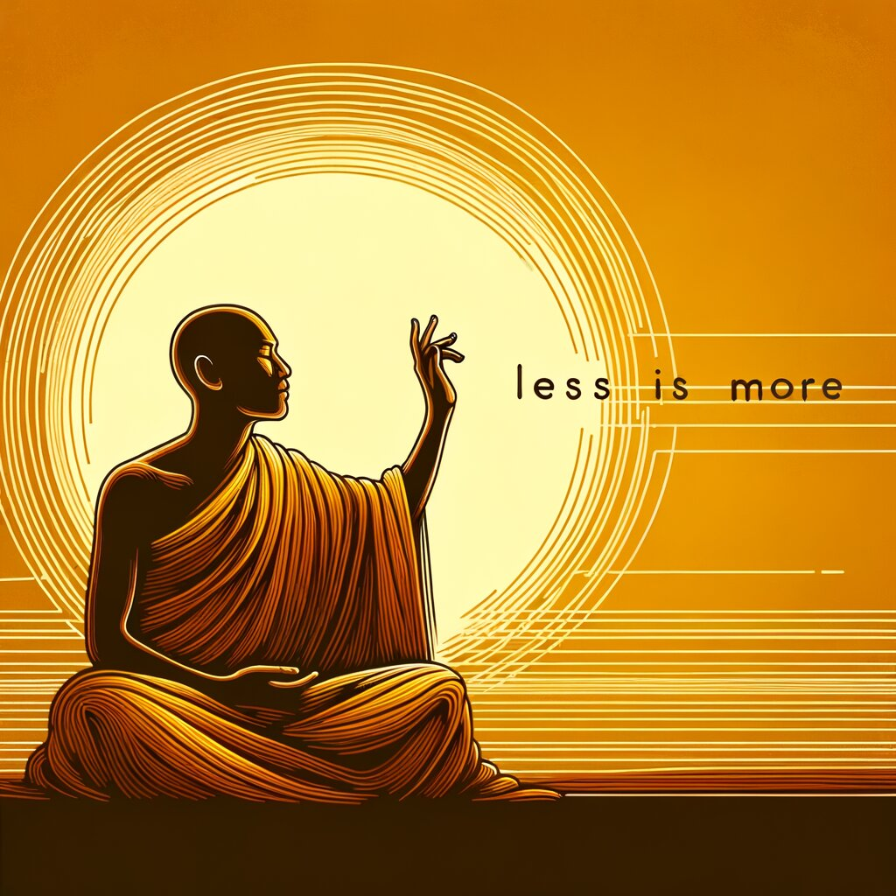
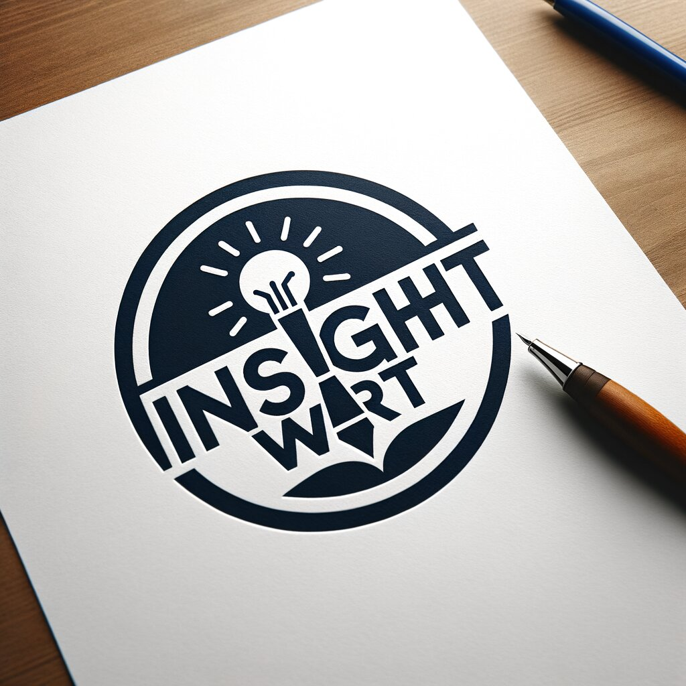
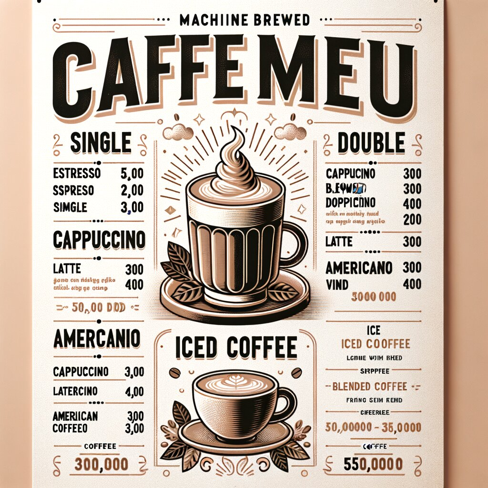

# Image Generation — Prompt Craft & Describe

> Text-to-image models paint from a prompt; vision models describe a picture back into text. Good results come from clear intent — often *less is more* — and from iterating on style, subject, and constraints. Everyday metaphor: briefing a illustrator in one sharp sentence.

## Why it matters

Image (and short video) generation is a parallel “demo” track to text classifiers: same idea of conditioning a model, different modality. Prompt craft transfers to agents that call image tools; describe↔generate loops show multimodal I/O.

## Key ideas

- **Prompt anatomy:** subject + style + composition + constraints (text-in-image is hard; logos need clarity).
- **Less is more:** overcrowded prompts fight themselves; start short, add only what failed.
- **Describe vs generate:** vision captioning tests recognition; generation tests control. Both live in the same multimodal stack.
- **Iterate with references:** keep a gallery of wins (menu art, calm landscapes, fantasy characters) as style anchors.
- **Video generators:** same prompting habits, plus motion / duration — treat as image craft with time.

## Illustrations








## Pipeline

```
intent → short prompt (+ refs) → generate → critique → revise prompt
                 ↘ describe(image) → text (optional check)
```

## Slides & demo

| | Link |
|--|------|
| Slides | [slides/image-gen](../slides/image-gen/index.html) |
| App | [demos/image-gen/app](../demos/image-gen/app/index.html) |

## Related

- [tokenize.md](./tokenize.md), [embedding.md](./embedding.md) — text side of multimodal
- [agentic-patterns.md](./agentic-patterns.md) — tool-use when agents call image APIs
