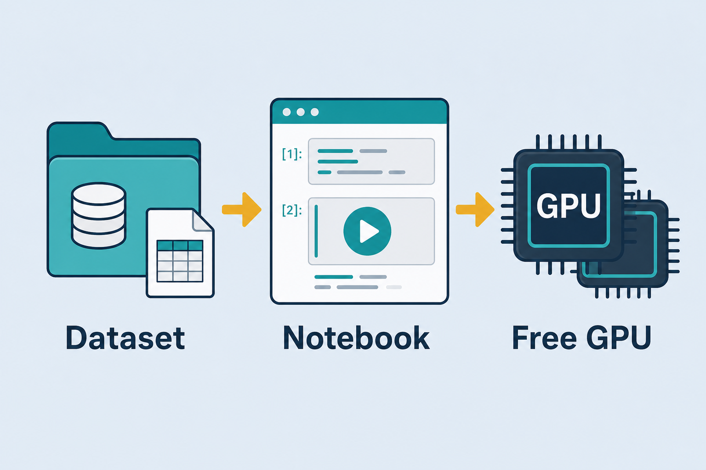
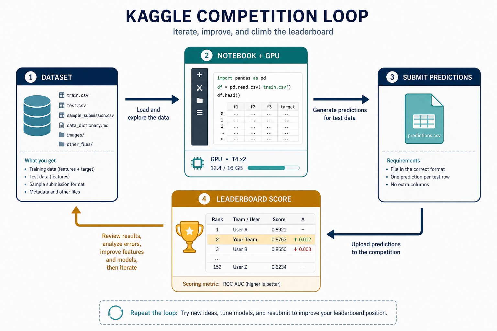

# Kaggle — free dataset + notebook + GPU

> ML learning and competition platform: huge **dataset** library, **notebooks** with free **GPU/TPU**, and **competitions** to practice. Similar to Hugging Face but tilted toward hands-on work and leaderboards. Everyday metaphor: a shared workshop with free tools, wood piles (datasets), and contests on the wall.

## Why it matters

When learning, two things are often missing: *good data* and *enough compute*. Kaggle offers both for free — diverse datasets and GPU notebooks in the browser. Competitions add leaderboards and public solutions so you can learn from what top performers do.

Pair it with [Hugging Face](./huggingface.md): grab a pretrained model from the Hub, train on Kaggle’s GPU, export the checkpoint into a lab demo.

## Key ideas

- **Datasets:** tens of thousands of public datasets, downloadable straight into a notebook (or via the Kaggle API: `kaggle datasets download -d owner/slug`).
- **Notebooks (Kernels):** built-in libraries (PyTorch, TF, sklearn…); enable GPU/TPU in settings → train without installing CUDA locally. Typical free GPU tiers are on the order of ~30 GPU hours/week (quota changes — check current Settings → Accelerator).
- **Competitions:** real problem + metric + leaderboard; submit predictions for a score. Read *public notebooks* for tips — reproducing a strong baseline teaches faster than starting blank.
- **Quota limits:** free GPU hours are capped per week — save them for real training runs, not idle kernels left open overnight. Disable the accelerator while debugging prints and plots.
- **HF connection:** often download data on Kaggle, grab a pretrained model from Hugging Face, then train in a Kaggle notebook (`!pip install -q transformers datasets` if needed).
- **Export:** download weights / ONNX / TorchScript → plug into [inference](./06-train-infer.md) demos (car-nn, sentiment…). Persist to a Kaggle Dataset version so the next session can `add data` instead of re-uploading.
- **Public vs private LB:** the public leaderboard is a visible slice; the private LB (final) can reshuffle ranks — overfit the public slice and you drop at the end.

## Short workflow

```
pick dataset (or competition) → new notebook → enable GPU
→ load data + HF model → train epochs → watch val metric
→ export checkpoint → use in demo / Space
```

## Worked example (intuition)

Competition: classify dog breeds from images. You fork a public EfficientNet notebook, swap in a Hub vision model, train 5 epochs on GPU, submit. Leaderboard feedback tells you if augmentation or LR was the real lever — not just “I trained something.”

Numbers to expect: ~10k labeled images, 120 breeds, EfficientNet-B0 fine-tune with LR `1e-3` (head) then `1e-4` (full), batch 32 on a P100/T4-class GPU → roughly 5–20 minutes/epoch depending on image size. If public LB is log-loss, a model at accuracy 0.85 can still lose to one with better-calibrated probs at accuracy 0.83 — optimize the **stated metric**, not vibes.

## Common pitfalls

- **Burning GPU quota on print-debug loops** — debug on CPU / tiny samples first.
- **Ignoring the competition metric** — optimizing accuracy when the score is log-loss.
- **Copy-paste without understanding** — public notebooks win until the private leaderboard; learn *why* steps exist.
- **No offline export plan** — notebook dies with the session; save artifacts to Kaggle datasets or download them.
- **Internet off in competitions** — many code comps disable network; pre-bundle datasets/models or use official competition data only.
- **Leaky preprocessing** — fitting scalers / augment stats on train+test together; fit on train only.

## Illustrations





## Deeper dive

- **Accelerator settings.** Notebook → Settings → Accelerator → GPU (or TPU). Verify with `!nvidia-smi` or `torch.cuda.is_available()`. Failure mode: code assumes CUDA but accelerator is **None** → silent CPU crawl that burns session time without using quota efficiently.
- **Quota economics.** GPU hours are weekly; interactive sessions count while the kernel is on. Pattern: prototype on CPU with `df.head()` / 1% sample → flip GPU on for the real `fit` / `Trainer.train()` → save checkpoint → turn GPU off. Leaving a Gradio loop or infinite plot refresh overnight wastes the week’s budget.
- **Metric alignment.** Competitions publish an exact score (log-loss, macro-F1, quadratic weighted kappa, …). Mini comparison: accuracy cares about hard labels; log-loss punishes confident wrong probs — temperature scaling or softer labels can raise LB without changing `argmax` accuracy. Always implement a **local** validation that mirrors the host metric.
- **Public notebooks as curriculum.** Sort by score, fork the simplest high scorer, delete unused cells, re-run end-to-end, then change one variable (LR, augmentation, model size). Blind stacking of 10 notebooks without a local CV usually overfits the public LB.
- **HF + Kaggle bridge.** `from_pretrained` needs network (or a pre-downloaded model Dataset). In offline comps, attach a Dataset that already contains the weights folder and point `from_pretrained("/kaggle/input/.../model")`. Tokenizer files must travel with the weights.
- **Export checklist.** Save: (1) `state_dict` / `.keras` / safetensors, (2) tokenizer / label map JSON, (3) preprocessing config (image size, normalize mean/std). Version them as a Kaggle Dataset. Without (2)–(3), the demo loads weights but predicts garbage.
- **CV discipline.** Prefer stratified *k*-fold or a fixed GroupKFold when related rows leak (same patient / same product). Report mean±std of the competition metric across folds before trusting a single public submit.

## Decision guide

| Situation | Prefer | Avoid / why |
|-----------|--------|-------------|
| Learning + free GPU for a lab model | Kaggle notebook + HF pretrained weights | Buying cloud GPU before you have a working CPU baseline |
| Debugging data / plotting | CPU accelerator (or tiny sample on GPU) | Full-data GPU epochs while fixing print typos |
| Competition scored by log-loss | Calibrated probs; match local CV to log-loss | Maximizing accuracy only — LB won’t move with you |
| Offline / no-internet code comp | Bundle model+tokenizer as a Dataset input | Runtime `pip install` / Hub download mid-submit |
| Keeping work across sessions | Versioned Kaggle Dataset of checkpoints | Relying on ephemeral `/kaggle/working` alone |
| Climbing the leaderboard | One change at a time + solid local CV | Mega-ensembles copied blindly before you understand the metric |

## Pipeline

```
Kaggle dataset → notebook (enable GPU) → train (epochs) → export model → inference
```

Same role as “data + GPU runtime” alongside [huggingface.md](./huggingface.md); stack overview at [train-gpu.md](./train-gpu.md).

## Slides & demo

| | Link |
|--|------|
| Slides | [slides/kaggle](../slides/kaggle/index.html) |

## References

- [Kaggle Datasets](https://www.kaggle.com/datasets) · [Notebooks](https://www.kaggle.com/code)
- [Kaggle Learn](https://www.kaggle.com/learn)

## Related

- [huggingface.md](./huggingface.md), [pytorch-training.md](./pytorch-training.md)
- [train-gpu.md](./train-gpu.md), [06-train-infer.md](./06-train-infer.md)
