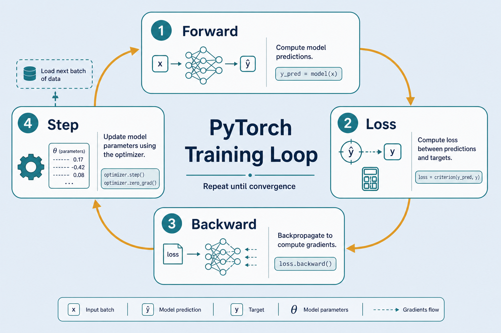
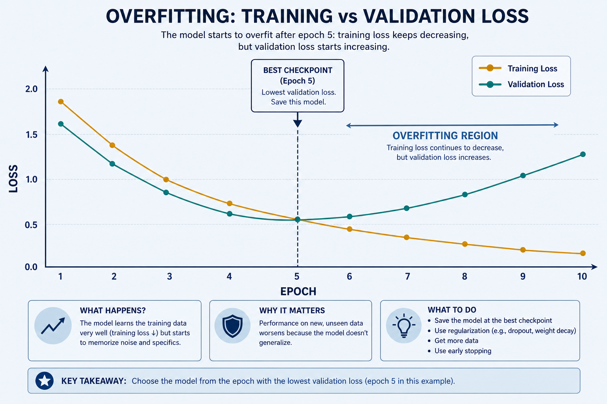

# Train with PyTorch

> A hands-on lesson: use PyTorch to train a classifier — epoch loop, compute loss, backprop, update weights until the model is good enough. Everyday metaphor: each batch is one practice set; each epoch is one full pass through the textbook.

## Why it matters

PyTorch is the most popular flexible framework for building and training models yourself. Understanding its training loop means understanding how learning actually happens — the same mechanism every high-level library ([Hugging Face](./huggingface.md), sentence-transformers) wraps underneath.

If you can write `forward → loss → backward → step` confidently, you can debug exploding loss, pick learning rates, and move models to GPU without treating training as a black box.

## Key ideas

- **Epoch vs batch:** an *epoch* is one pass over all data; a *batch* is a small chunk processed per step. Many epochs let the model learn gradually. Large batches are stabler but need more memory; small batches are noisier but can generalize better. Rule of thumb: for *N* examples and batch size *B*, steps per epoch ≈ `⌈N/B⌉` — e.g. 10 000 examples / batch 32 ≈ 313 steps/epoch.
- **Four steps per batch:**
  1. `zero_grad()` — clear old gradients (they accumulate by default).
  2. **Forward** — `logits = model(x)`.
  3. **Loss** — compare logits to labels (e.g. `CrossEntropyLoss`).
  4. **`backward()`** then **`step()`** — compute gradients, update weights.
- **Optimizer and learning rate:** Adam/SGD decides how far to move each step. LR too high → unstable jumps / NaNs; too low → painfully slow learning. Start with `1e-3` for Adam on small nets; fine-tuning Transformers often uses `2e-5`–`5e-5`. AdamW (`weight_decay≈0.01`) is the usual default for Transformers.
- **Train/val split:** track **validation** loss to catch *overfitting* (memorizes training data, fails on new data). Rising val loss while train loss falls is the classic signal. Prefer saving the checkpoint with best *val* metric, not the last epoch.
- **GPU:** `.to("cuda")` (or `"mps"` on Apple Silicon) for **both** model and each batch → much faster training; see [train-gpu.md](./train-gpu.md). Mixed precision (`torch.cuda.amp`) often ~1.5–2× throughput on modern NVIDIA GPUs with little accuracy loss.
- **When done, save:** `torch.save(model.state_dict(), "ckpt.pt")` → checkpoint for [inference](./06-train-infer.md). Prefer saving the best val checkpoint, not only the last epoch. Also save optimizer state if you plan to resume: `{"model": ..., "opt": ..., "epoch": ...}`.
- **Autograd graph:** only tensors with `requires_grad=True` (parameters) get gradients. Detach with `.detach()` or wrap eval in `torch.no_grad()` so validation does not build a graph or leak memory.

## Training loop (skeleton)

```python
model = MyClassifier()
opt = torch.optim.Adam(model.parameters(), lr=1e-3)
loss_fn = nn.CrossEntropyLoss()

for epoch in range(EPOCHS):
    model.train()
    for x, y in dataloader:          # each batch
        opt.zero_grad()              # clear old gradients
        logits = model(x)            # forward
        loss = loss_fn(logits, y)    # compare to labels
        loss.backward()              # backprop: compute gradients
        opt.step()                   # update weights

    # optional: model.eval(); measure val loss / accuracy
```

## Worked example (intuition)

Suppose a tiny binary classifier is wrong on a batch. Loss is high → `backward()` assigns blame to each weight → `step()` nudges weights slightly so the next forward pass is a bit less wrong. After thousands of batches, the decision boundary fits the data. That is all “learning” is, at the loop level.

Concrete numbers: batch size 32, LR `1e-3`, Adam. If `loss` drops from ~0.69 (random binary CE) to ~0.25 over a few epochs while val loss follows, you are learning. If train loss → 0.05 but val loss climbs from 0.30 → 0.55, you are overfitting — add dropout, early-stop, or more data. Gradient clipping (`clip_grad_norm_(params, max_norm=1.0)`) before `step()` is a common fix when loss spikes to NaN on deeper nets.

## Common pitfalls

- **Forgot `zero_grad()`** — gradients stack across batches → wild updates.
- **Train mode at eval** — dropout/batchnorm behave differently; use `model.eval()` + `torch.no_grad()` when validating.
- **Device mismatch** — model on CUDA, batch on CPU → runtime error. Move both.
- **Leaky validation** — tuning hyperparameters on the test set; keep a true held-out test.
- **In-place ops on views** — rare but real: mutating a tensor that is still needed for autograd breaks the graph; prefer functional style inside `forward`.

## Illustrations






## Deeper dive

- **Why `zero_grad()` exists.** PyTorch *accumulates* gradients into `.grad` so you can simulate large batches: run `backward()` on micro-batches of 8 four times, then one `step()` ≈ batch 32. Forgetting `zero_grad()` means every step also applies yesterday’s gradients — loss often explodes within a few iterations.
- **`CrossEntropyLoss` expects raw logits.** It applies `log_softmax` + NLL internally. Do **not** put `softmax` in the model before this loss (double-softmax / wrong scale). Shape: logits `[B, C]`, labels `[B]` long integers in `0..C-1`. Softmax belongs at inference when you need probabilities.
- **Learning-rate schedules.** Constant LR is fine for tiny MLPs. For Transformers, linear warmup (e.g. 500–2000 steps) then linear/cosine decay is standard — avoids early gradient shock. Formula for linear warmup: `lr_t = lr_max · t / T_warm` for `t < T_warm`.
- **Overfitting signature.** Plot train vs val loss: healthy curves fall together; overfit when train keeps falling and val rises after epoch *k*. Fix: early stopping at *k*, stronger weight decay, dropout, data augmentation, or more data — not “more epochs.”
- **AMP and grad scaling.** `with autocast(): loss = ...` then `scaler.scale(loss).backward(); scaler.step(opt); scaler.update()`. Failure mode: unscaled underflow → silent zero grads; the GradScaler exists to prevent that.
- **DataLoader knobs that matter.** `num_workers=2–4`, `pin_memory=True` (CUDA), and `persistent_workers=True` often matter more than micro-optimizing the model once GPU util is &lt;50%. Shuffle train, not val. Set `torch.manual_seed` + `generator` for reproducible splits.
- **Compare to Keras.** Same math; PyTorch makes the loop explicit (easier custom losses, GANs, RL). Cost: you own `train()`/`eval()`, device moves, and checkpointing. Prefer PyTorch when you need non-standard training; prefer Keras `fit` for fast baselines ([tensorflow-training.md](./tensorflow-training.md)).

## Decision guide

| Situation | Prefer | Avoid / why |
|-----------|--------|-------------|
| Small MLP / softmax regression demo | Adam `lr=1e-3`, full batch loop as above | Tiny LR like `1e-6` — looks “stuck” for hours |
| Fine-tuning BERT / MiniLM | AdamW `2e-5`–`5e-5`, warmup, freeze or LoRA if tiny data | Adam `1e-3` on all layers — often destroys pretrained features |
| Val loss rising, train falling | Early stop + best checkpoint; more regularization | More epochs on the same setup — deepens overfit |
| Custom loss / multi-task / RL | Explicit PyTorch loop | Fighting Keras `fit` with awkward callbacks |
| GPU OOM at batch 32 | Gradient accumulation (4×8) or AMP | Blindly lowering LR — doesn’t free memory |
| Publishing a reproducible run | Seed + fixed DataLoader generator + saved config | Only saving final weights with no hyperparams log |

## Pipeline

```
dataset → DataLoader → [epoch loop: forward → loss → backward → step] → checkpoint
```

This is how to implement training for [classification.md](./classification.md); the TensorFlow version is at [tensorflow-training.md](./tensorflow-training.md).

## Slides & demo

| | Link |
|--|------|
| Slides | [slides/pytorch-training](../slides/pytorch-training/index.html) |

## References

- [PyTorch — Training a classifier](https://pytorch.org/tutorials/beginner/blitz/cifar10_tutorial.html)
- [torch.optim](https://pytorch.org/docs/stable/optim.html)

## Related

- [classification.md](./classification.md), [tensorflow-training.md](./tensorflow-training.md)
- [train-gpu.md](./train-gpu.md), [huggingface.md](./huggingface.md), [06-train-infer.md](./06-train-infer.md)
