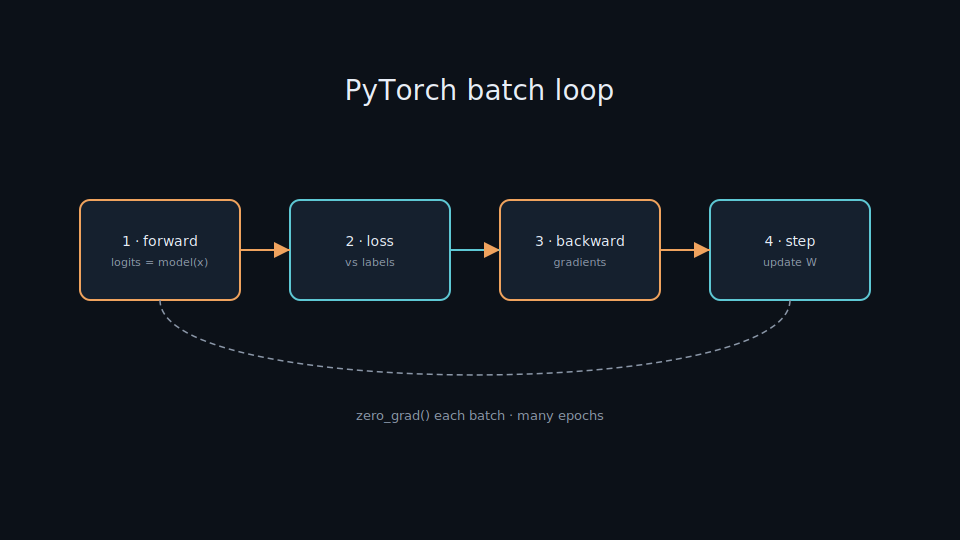

# Train with PyTorch

> A hands-on lesson: use PyTorch to train a classifier — epoch loop, compute loss, backprop, update weights until the model is good enough. Everyday metaphor: each batch is one practice set; each epoch is one full pass through the textbook.

## Why it matters

PyTorch is the most popular flexible framework for building and training models yourself. Understanding its training loop means understanding how learning actually happens — the same mechanism every high-level library ([Hugging Face](./huggingface.md), sentence-transformers) wraps underneath.

If you can write `forward → loss → backward → step` confidently, you can debug exploding loss, pick learning rates, and move models to GPU without treating training as a black box.

## Key ideas

- **Epoch vs batch:** an *epoch* is one pass over all data; a *batch* is a small chunk processed per step. Many epochs let the model learn gradually. Large batches are stabler but need more memory; small batches are noisier but can generalize better.
- **Four steps per batch:**
  1. `zero_grad()` — clear old gradients (they accumulate by default).
  2. **Forward** — `logits = model(x)`.
  3. **Loss** — compare logits to labels (e.g. `CrossEntropyLoss`).
  4. **`backward()`** then **`step()`** — compute gradients, update weights.
- **Optimizer and learning rate:** Adam/SGD decides how far to move each step. LR too high → unstable jumps / NaNs; too low → painfully slow learning. Start with `1e-3` for Adam on small nets; fine-tuning Transformers often uses `2e-5`–`5e-5`.
- **Train/val split:** track **validation** loss to catch *overfitting* (memorizes training data, fails on new data). Rising val loss while train loss falls is the classic signal.
- **GPU:** `.to("cuda")` (or `"mps"` on Apple Silicon) for **both** model and each batch → much faster training; see [train-gpu.md](./train-gpu.md).
- **When done, save:** `torch.save(model.state_dict(), "ckpt.pt")` → checkpoint for [inference](./06-train-infer.md). Prefer saving the best val checkpoint, not only the last epoch.

## Training loop (skeleton)

```python
model = MyClassifier()
opt = torch.optim.Adam(model.parameters(), lr=1e-3)
loss_fn = nn.CrossEntropyLoss()

for epoch in range(EPOCHS):
    model.train()
    for x, y in dataloader:          # each batch
        opt.zero_grad()              # clear old gradients
        logits = model(x)            # forward
        loss = loss_fn(logits, y)    # compare to labels
        loss.backward()              # backprop: compute gradients
        opt.step()                   # update weights

    # optional: model.eval(); measure val loss / accuracy
```

## Worked example (intuition)

Suppose a tiny binary classifier is wrong on a batch. Loss is high → `backward()` assigns blame to each weight → `step()` nudges weights slightly so the next forward pass is a bit less wrong. After thousands of batches, the decision boundary fits the data. That is all “learning” is, at the loop level.

## Common pitfalls

- **Forgot `zero_grad()`** — gradients stack across batches → wild updates.
- **Train mode at eval** — dropout/batchnorm behave differently; use `model.eval()` + `torch.no_grad()` when validating.
- **Device mismatch** — model on CUDA, batch on CPU → runtime error. Move both.
- **Leaky validation** — tuning hyperparameters on the test set; keep a true held-out test.

## Illustrations




## Pipeline

```
dataset → DataLoader → [epoch loop: forward → loss → backward → step] → checkpoint
```

This is how to implement training for [classification.md](./classification.md); the TensorFlow version is at [tensorflow-training.md](./tensorflow-training.md).

## Slides & demo

| | Link |
|--|------|
| Slides | [slides/pytorch-training](../slides/pytorch-training/index.html) |

## References

- [PyTorch — Training a classifier](https://pytorch.org/tutorials/beginner/blitz/cifar10_tutorial.html)
- [torch.optim](https://pytorch.org/docs/stable/optim.html)

## Related

- [classification.md](./classification.md), [tensorflow-training.md](./tensorflow-training.md)
- [train-gpu.md](./train-gpu.md), [huggingface.md](./huggingface.md), [06-train-infer.md](./06-train-infer.md)
