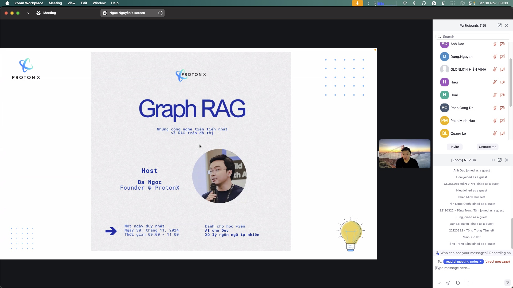
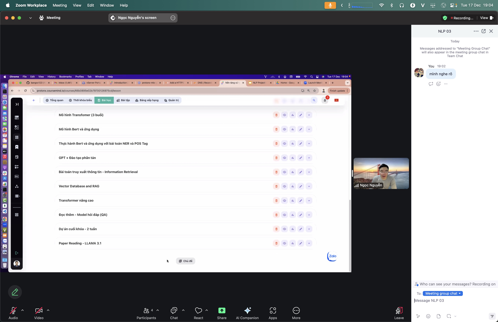

# RAG — Retrieval-Augmented Generation

> Instead of forcing the model to answer from memory alone, first *look up* relevant documents, then let the model *compose* an answer grounded in them. Like checking a book before you speak.

## Why it matters

Language models know a lot but often hallucinate on unfamiliar facts and cannot read your private documents. RAG fixes both: anchor answers in a real corpus (company docs, videos, repos…) with citations. Answers become more accurate, more current, and verifiable — without retraining the model.

## Key ideas

- **Two phases:**
  - *Retrieve:* embed the question ([embedding.md](./embedding.md)), search the vector DB for the top-k chunks closest in meaning.
  - *Generate:* insert those chunks into the prompt as context; the model composes the answer from them.
- **Chunk + vector DB:** split documents into segments, embed each segment; a DB (FAISS, Chroma, pgvector…) finds nearest segments fast, optionally filtered by metadata.
- **Unlike pure chat:** pure chat relies on model memory; RAG is always *anchored to your corpus* — it can answer about documents the model never saw.
- **Quality depends on retrieval:** wrong chunks → wrong answers no matter how good the model is. Good chunking and embeddings are critical.
- **Advanced variants:** *Graph RAG* links entities in a graph for multi-hop questions; reranking and hybrid search (keyword + vector) boost accuracy.

## Illustrations






## Pipeline

```
question → embed → top-k from vector DB → (chunks + question) → LLM → answer + citations
```

RAG stands on [embedding.md](./embedding.md); the lab's Personal Knowledge-base follows this direction ([personal-knowledge-base.md](./personal-knowledge-base.md)).

## Slides & demo

| | Link |
|--|------|
| Slides | [slides/rag](../slides/rag/index.html) |
| Working app | [demos/rag/app](../demos/rag/app/index.html) |

## References

- Lewis et al. 2020 — [Retrieval-Augmented Generation](https://arxiv.org/abs/2005.11401)
- [Microsoft GraphRAG](https://microsoft.github.io/graphrag/)

## Related

- [vector-database.md](./vector-database.md), [semantic-search.md](./semantic-search.md) — infrastructure and retrieval for RAG
- [advanced-rag.md](./advanced-rag.md) — query translation, HyDE, RAPTOR, ColBERT
- [embedding.md](./embedding.md), [personal-knowledge-base.md](./personal-knowledge-base.md)
