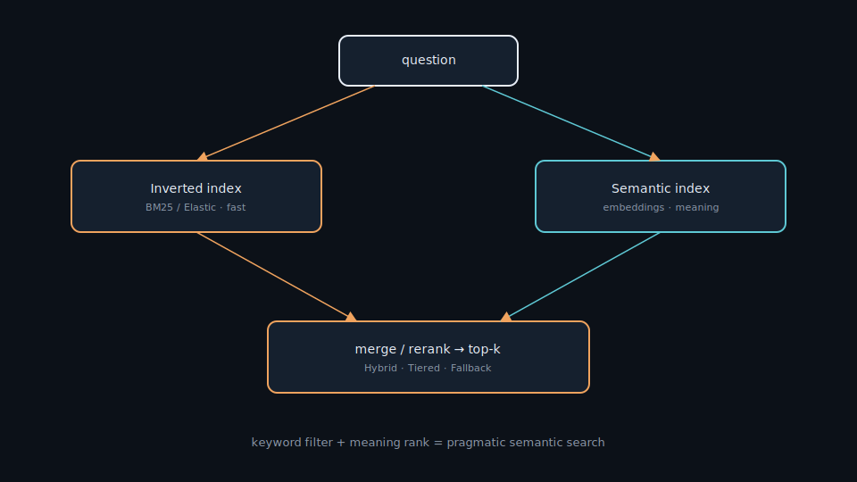
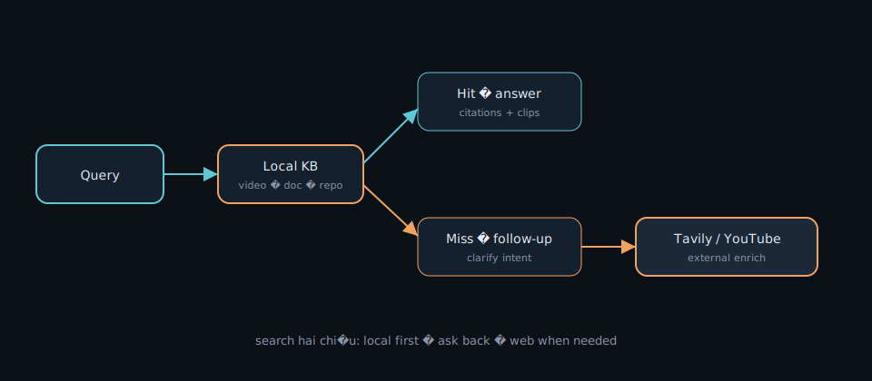
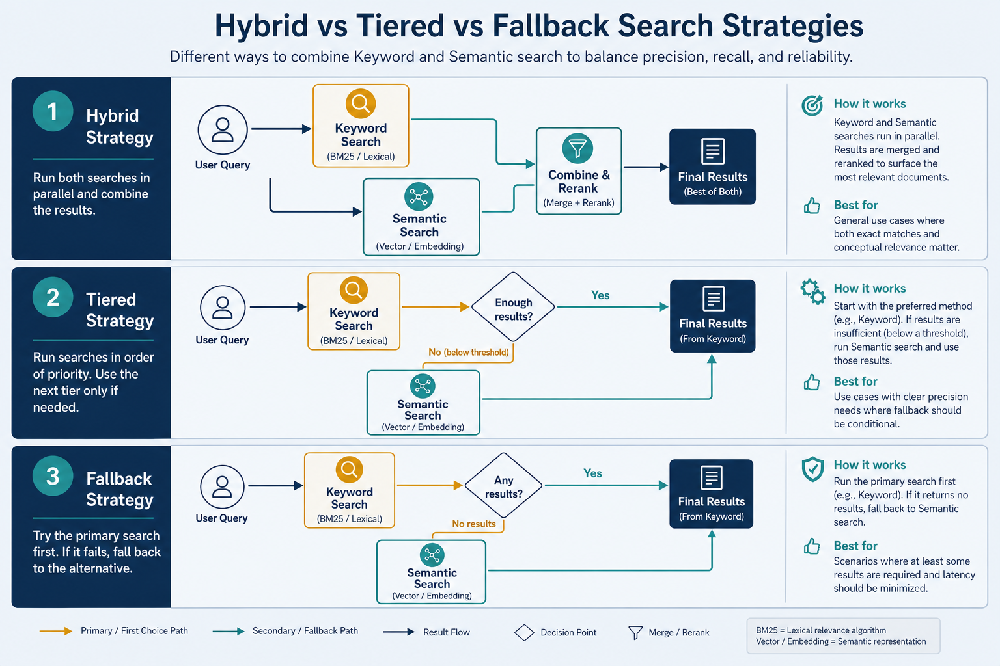

# Semantic search — hybrid · tiered · fallback

> Search by *meaning*, not just keywords, by combining two index types: inverted index (Elastic, by keyword) and semantic index (embedding, by meaning). This is the project I built to learn RAG deeply.

> Repo: [github.com/hoanganh25991/semantic-search](https://github.com/hoanganh25991/semantic-search) — Hybrid / Tiered / Fallback on the MS MARCO dataset.

## Why it matters

Keyword search (BM25 / TF-IDF in Elastic) is fast and cheap, but “car” and “automobile” are different strings — easy to miss matches. Embedding search captures meaning but is heavier to run on every query. Pragmatic semantic search **combines** both: use keywords to filter quickly, embeddings to rank by meaning. That is also a high-quality retrieve step for [RAG](./rag.md).

## Key ideas

- **Two index types:**

  | Index | Mechanism | Strong | Weak |
  |-------|-----------|--------|------|
  | **Inverted index** (Elastic) | keyword → documents | fast, cheap, precise on exact terms | no synonym understanding |
  | **Semantic index** (embedding) | vectors in [vector database](./vector-database.md) | captures meaning, varied phrasing | heavier, needs a model |

- **Three search strategies:**
  - *Hybrid:* inverted index *filters* candidates by keyword, semantic index *reranks* by meaning. Cost-efficient; fails when keywords miss entirely.
  - *Tiered:* classify questions as easy/hard first → easy goes keyword, hard goes semantic. Balances speed and precision (same idea as [complexity router](./05-demo-text.md)).
  - *Fallback:* semantic first for max accuracy; if results are poor, *fall back* to keyword. Most accurate, most expensive.
- **Dataset and evaluation:** MS MARCO — real user questions plus relevant passages. Metrics: *Precision@k*, *MRR@10*. A query classifier labels simple vs complex questions for the Tiered strategy.
- **Storage:** MongoDB for raw documents; Elasticsearch for indexed data (inverted + kNN) for fast search.
- **Why this teaches RAG:** retrieval quality dominates answer quality — the same lesson as [rag.md](./rag.md), measured with ranking metrics instead of vibes.

## Worked example (intuition)

Question: `"How do I jump-start a car?"`

- Keyword alone may miss docs that only say `"boost a vehicle battery"`.
- Semantic alone may retrieve vaguely related automotive posts.
- Hybrid: keyword keeps battery/car candidates, semantic ranks the jump-start guide to the top.

## Common pitfalls

- **Hybrid with empty keyword hits** — need a fallback path when BM25 returns nothing.
- **Tiered with a bad easy/hard classifier** — hard queries wrongly sent to keyword.
- **Optimizing only public leaderboards** — overfit MS MARCO quirks; validate on your own corpus.
- **Ignoring latency budgets** — semantic-on-everything can blow SLAs.

## Illustrations









## Pipeline

```
question → (classify easy/hard) → { keyword: inverted index | meaning: semantic index }
         → merge / rerank → top-k → RAG
```

Semantic search stands on [embedding.md](./embedding.md) + [vector-database.md](./vector-database.md), and is the retrieval step for [rag.md](./rag.md).

## Slides & demo

| | Link |
|--|------|
| Slides | [slides/semantic-search](../slides/semantic-search/index.html) |
| GitHub | [hoanganh25991/semantic-search](https://github.com/hoanganh25991/semantic-search) |

## References

- Repo: [hoanganh25991/semantic-search](https://github.com/hoanganh25991/semantic-search)
- [MS MARCO](https://microsoft.github.io/msmarco/) · [Elasticsearch kNN](https://www.elastic.co/guide/en/elasticsearch/reference/current/knn-search.html)

## Related

- [vector-database.md](./vector-database.md), [rag.md](./rag.md), [embedding.md](./embedding.md)
- [05-demo-text.md](./05-demo-text.md) — complexity router (same tiered idea)
