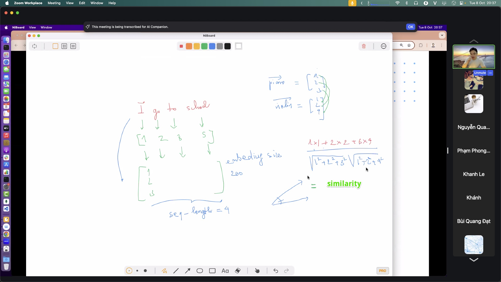
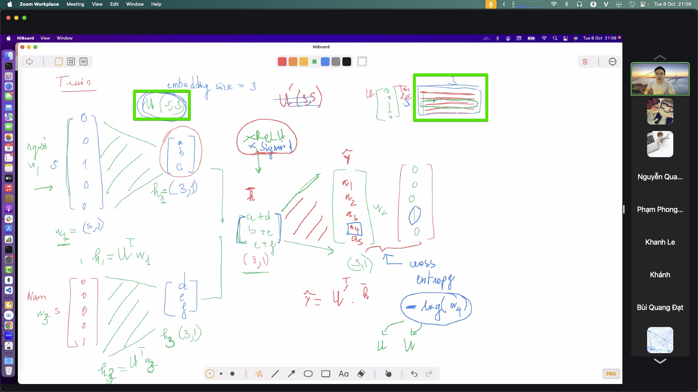
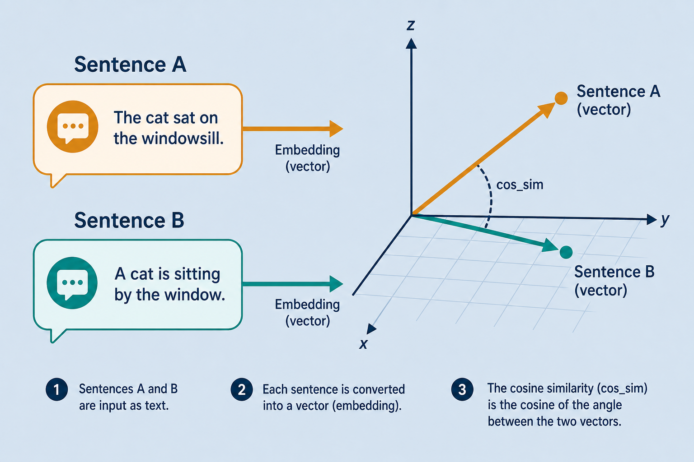

# sentence-transformers — sentence embedding in a few lines

> A Hugging Face library that turns a whole sentence into a high-quality vector in just a few lines. Classification and similarity tasks become fast and simple. Everyday metaphor: instead of weighing every letter, you stamp the whole postcard into one coordinate on a meaning map.

## Why it matters

Training an embedding model yourself takes serious effort. `sentence-transformers` packages pretrained models (e.g. `all-MiniLM`, `paraphrase-mpnet`) so `encode()` returns vectors ready to use. For many problems, good embeddings plus a light classifier are enough — no need to fine-tune a large network.

This is the shortest path from [embedding.md](./embedding.md) into [semantic-search.md](./semantic-search.md), [vector-database.md](./vector-database.md), and retrieval for [rag.md](./rag.md).

## Key ideas

- **Sentence → one vector:** `encode()` returns embeddings optimized for *sentence-level* meaning comparison (not per-token vectors). Pooling (often mean of token states) is already baked in.
- **Fast classification:** encode sentences, then attach a light classifier (logistic / k-NN) on top — no full Transformer fine-tune required for many text tasks.
- **Similarity and search:** `util.cos_sim` finds semantically close sentences; core of semantic search and RAG retrieve.
- **Load into a vector DB:** vectors from `encode()` go straight into a vector database for top-k search.
- **Pick a model for the job:**
  - *MiniLM* (`all-MiniLM-L6-v2`) — light and fast; great default for demos.
  - *mpnet* — more accurate, heavier.
  - Multilingual variants when you mix languages.
- **Same space for query and docs:** encode both with the same model; never mix two incompatible checkpoints in one index.

## Quick use

```python
from sentence_transformers import SentenceTransformer, util

model = SentenceTransformer("all-MiniLM-L6-v2")
emb = model.encode(["Hello", "Hi there", "Battery life is awful"])
print(util.cos_sim(emb[0], emb[1]))  # high — greetings
print(util.cos_sim(emb[0], emb[2]))  # lower — different topic
```

## Worked example (intuition)

Corpus of FAQ answers. Encode all offline → store in FAISS/Chroma. At query time, encode the user question → top-5 FAQs by cosine → pass to an LLM for a grounded reply ([rag.md](./rag.md)). The heavy model ran once per document; queries stay cheap.

## Common pitfalls

- **Mixing models in one index** — dimensions and geometry won’t match.
- **Using token embeddings as if they were sentence vectors** — wrong pooling.
- **Cosine vs dot without normalizing** — rankings shift; know which metric your DB expects.
- **Encoding huge batches on CPU only** — fine for tiny demos; use GPU for large corpora.

## Illustrations







## Pipeline

```
sentence → SentenceTransformer.encode → vector → { cos_sim | light classifier | vector DB }
```

## Slides & demo

| | Link |
|--|------|
| Slides | [slides/sentence-transformers](../slides/sentence-transformers/index.html) |
| Related demo | [demos/embedding](../demos/embedding/app/index.html) |

## References

- [SBERT / sentence-transformers](https://www.sbert.net/)
- Reimers & Gurevych 2019 — [Sentence-BERT](https://arxiv.org/abs/1908.10084)

## Related

- [embedding.md](./embedding.md), [classification.md](./classification.md)
- [semantic-search.md](./semantic-search.md), [vector-database.md](./vector-database.md), [huggingface.md](./huggingface.md)
