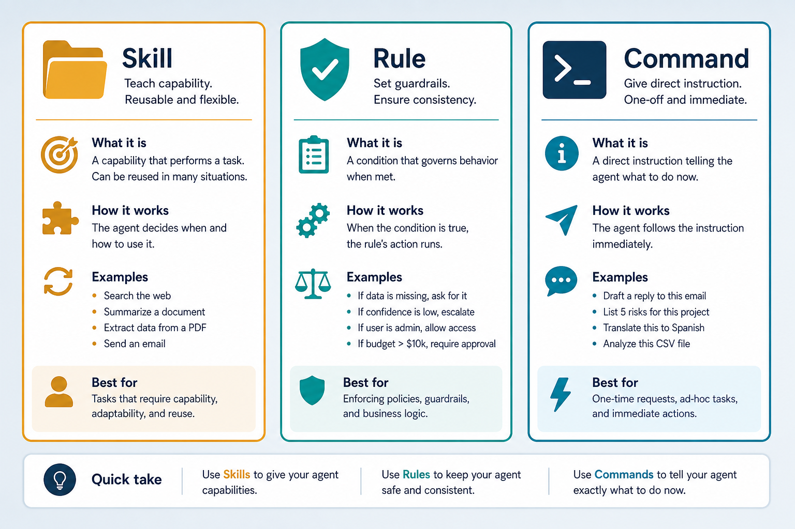
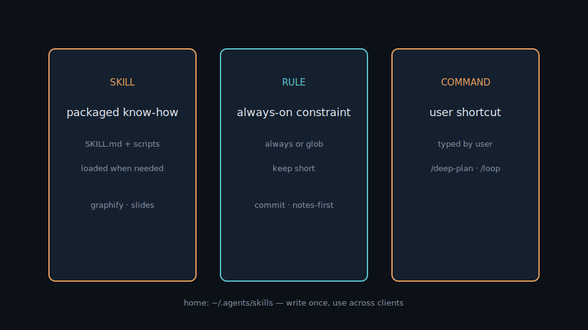
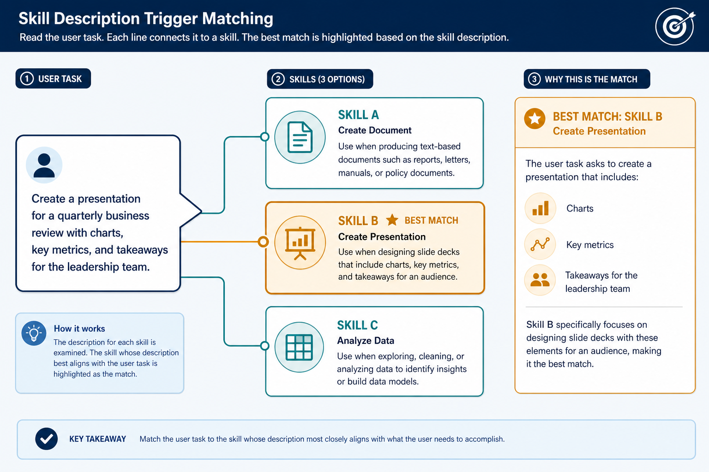

# Skills · Rules · Commands

> Three ways to teach a coding agent. **Skill** = packaged capability loaded when needed; **Rule** = constraint that always applies; **Command** = shortcut to kick off a workflow. Everyday metaphor: skills are toolboxes you open for a job, rules are house laws on the wall, commands are buttons you press.

## Why it matters

The same model, loaded with the right know-how, works far better: it knows your process, follows project conventions, and you do not repeat instructions every turn. These three layers are how that “brain gets configured.” Put mandatory things in rules, complex processes in skills, and frequent workflows in commands.

Without this split, agents either ignore your conventions or burn context repeating them.

## Key ideas

- **Three concepts:**

  | Kind | What | When loaded | Example |
  |------|------|-------------|---------|
  | **Skill** | folder with `SKILL.md` (+ scripts/assets) | model reads when task matches description | `graphify`, `frontend-slides`, `tavily-*` |
  | **Rule** | instructions always on or matched by glob | every turn (always) or on file pattern | commit style, “docs = notes-first” |
  | **Command** | prompt / workflow via shortcut | user types it (e.g. `/deep-plan`) | `/graphify .`, `/loop` |

- **SKILL.md structure:**

  ```
  ~/.agents/skills/<name>/SKILL.md
  ---
  name: <name>
  description: when to use this skill  ← model uses this to auto-trigger
  ---
  # step-by-step guide + script paths
  ```

  The **description** is the most important field: write a clear trigger (“use when…”) *and* negative space (“do not use when…”) so the agent picks correctly. Skills can include scripts the agent runs via shell/MCP.

- **Description triggers (how auto-load works):** clients expose skill names + descriptions to the model (often as a compact catalog). The model decides which `SKILL.md` bodies to read. Vague descriptions (“helps with coding”) either never fire or fire constantly; specific verbs + artifacts (“create HTML slides”, “export PPTX”, “crawl with Tavily”) match user intent reliably.
- **Context cost:**
  - *Always rules* are injected every turn → pay tokens forever; keep them short (dozens of lines, not novels).
  - *Glob rules* load only when matching files are in play → cheaper.
  - *Skills* cost catalog tokens always (descriptions) + full `SKILL.md` tokens when triggered. A 2k-line skill loaded by mistake is an expensive false positive.
  - Prefer: short always-rules → glob rules for file conventions → deep procedures in skills → user `/commands` for intentional heavy workflows.
- **Global home: `~/.agents`**
  - Canonical path: `~/.agents/skills/<name>/SKILL.md`.
  - Cursor / Claude / Pi load from here → write once, use across clients.
  - Do not copy skills into `~/.cursor/skills` or `~/.claude/skills` (keep empty); Pi uses **symlinks** to `~/.agents` only.
  - Install GitHub skill packs with the custom manager (`skill.sh` / lockfile) — not `npx skills` for `~/.agents`.
- **Project-local exception:** repo-specific skills may live in that repo’s `.cursor/skills`. Global skills stay in `~/.agents/skills`.
- **Skill interactions:** overlapping triggers (two PDF skills, two “search the web” skills) cause hesitation or contradictory steps. Strong models often ask to clarify — design descriptions to reduce collisions; document precedence in the skill body when overlap is intentional.

## Worked example (intuition)

You want every AI Lab change to stay notes-first.

1. **Rule (glob):** on `notes/**`, a short always-ish rule: “edit English notes under `notes/`; keep section structure; don’t invent slide assets.” Cost: only when note files are touched — not on every unrelated TypeScript edit.
2. **Skill trigger:** you ask “build a new deck about vector DBs.” The agent sees `frontend-slides` description (“create stunning HTML presentations…”) → reads that `SKILL.md` → follows the slide workflow. A vague skill named `docs` with description “helps with documentation” might *also* fire and fight over format — tighten descriptions.
3. **Command:** you type `/graphify .` when you want a fresh knowledge graph — explicit, no reliance on the model guessing. Commands are ideal for expensive or rare workflows you don’t want auto-triggered.
4. **Context math (rough):** a 150-line always-rule × every turn on a busy day wastes more tokens than a 400-line skill loaded twice a week. Move depth out of always-rules.

## Common pitfalls

- **Always-rules that are novels** — waste tokens every turn; split into globs/skills.
- **Vague skill descriptions** — agent never auto-triggers, or triggers on everything.
- **Duplicating skill trees** into Cursor/Claude folders — drift and double maintenance.
- **Conflicting skills** — two skills claim the same trigger with opposite steps.
- **Putting secrets in rules/skills** — they may be copied into prompts and logs; use env/secret stores.
- **Command sprawl** — twenty overlapping `/foo` shortcuts nobody remembers; prefer skills for discovery, commands for the few high-value rituals.

## Illustrations







## Deeper dive

- **Trigger writing pattern:** `Use when the user asks to X, Y, or Z (artifacts: .pptx, HTML slides). Do not use for ordinary markdown notes or code refactors.` Positive + negative triggers cut false positives sharply.
- **Catalog vs body:** the model may only see `name` + `description` until it chooses to open the file. If the *only* disambiguation lives buried in the body, the wrong skill gets selected — put disambiguation in the description.
- **Token budget intuition:** always-rules are a tax on *every* request (including “fix the typo”). If an always-rule exceeds ~50–100 lines, ask whether half belongs in a skill. Skills that exceed ~500–1000 lines should link to scripts/docs instead of inlining everything.
- **Progressive disclosure:** good skills say “read `references/foo.md` only if doing bar” — agents that follow this avoid stuffing the whole tree into context on every trigger.
- **Installation path:** `~/.agents/scripts/skill.sh install owner/repo --id my-pack` then `sync` / `check`. Parallel copies under `~/.cursor/skills` defeat the single source of truth — keep one tree under `~/.agents`.
- **Failure mode — silent non-trigger:** user says “make slides” but description only lists “PPTX export” → skill never loads → agent freestyles a worse deck. Fix descriptions when you observe misses in real chats.
- **Failure mode — trigger storm:** five search skills all match “research X” → model loads multiple huge SKILL.md files → context pressure and contradictory citation rules. Narrow descriptions; add explicit “prefer this over…” notes.
- **Rule lint habit.** Periodically grep always-rules for length and secrets; if two always-rules contradict (e.g. “always commit” vs “never commit unless asked”), the model will zigzag — resolve precedence explicitly.
- **Command vs skill ownership.** If users must remember a slash command for a workflow that should auto-appear from natural language, promote the procedure into a skill description; keep `/commands` for rare, expensive, intentional rituals.

## Decision guide

| Situation | Prefer | Avoid / why |
|-----------|--------|-------------|
| Must never violate (license, secrets, notes-first) | Short always or glob **rule** | Burying it only in a skill — may not load |
| Multi-step specialized workflow (slides, graphify, browser QA) | **Skill** with crisp description | Always-rule novel — pays tokens forever |
| You want an intentional, rare, expensive ritual | **Command** (`/graphify`, `/deep-plan`) | Auto-trigger skill that surprises mid-chat |
| Convention only for `*.tsx` or `notes/**` | Glob **rule** | Global always-rule for file-local style |
| Two skills overlap on “search / research” | Tighten descriptions; document precedence | Shipping both vague — trigger storms |
| Sharing across Cursor / Claude / Pi | Single tree in `~/.agents/skills` | Copy-paste into client-specific skill folders |

## Case study

Keep AI Lab notes English and structured without pasting the same instructions every chat.

- **Inputs:** project glob rule on `notes/**`; global skills in `~/.agents/skills` (`frontend-slides`, `graphify`, …); occasional `/graphify .` command.
- **Steps:** author a short glob rule (section order, English-only, don’t invent slide assets) → tighten skill descriptions with positive + negative triggers → ask “build a vector-DB deck” and confirm only `frontend-slides` loads → use `/graphify .` when you want an intentional graph rebuild.
- **Output:** agents follow notes conventions when editing markdown; slide requests don’t fight a vague “docs” skill; graph rebuilds are explicit and rare.
- **What you'd check:** always-rule token size; skill description false positives in real chats; no duplicate trees under `~/.cursor/skills`; secrets never pasted into rules.

## Lab checklist

- [ ] Open one `SKILL.md` and rewrite its description with “use when” + “do not use when”
- [ ] Add or inspect a short glob rule that applies only to a folder you care about
- [ ] Trigger a skill via natural language and confirm the agent read the skill body
- [ ] Run one intentional `/command` workflow and note why it should not auto-fire
- [ ] Measure rough line count of always-on rules; move any novel-length block into a skill
- [ ] Verify skills live under `~/.agents/skills` (not duplicated per client)
- [ ] Create a deliberate overlap between two skill descriptions, then resolve precedence
- [ ] Scan rules/skills for secrets or personal tokens and remove any found

## Pipeline

```
task → (rules always/glob) + (matching skills) + (optional /command) → agent acts with MCP/tools
```

## Slides & demo

| | Link |
|--|------|
| Slides | [slides/skills-rules](../slides/skills-rules/index.html) |
| MCP demo | [demos/mcp](../demos/mcp/app/index.html) |

## References

- [Anthropic — Agent Skills](https://www.anthropic.com/news/skills)
- [AGENTS.md](https://agents.md/) — standard for declaring agent instructions

## Related

- [mcp.md](./mcp.md), [07-agents.md](./07-agents.md), [08-model-notes.md](./08-model-notes.md)
