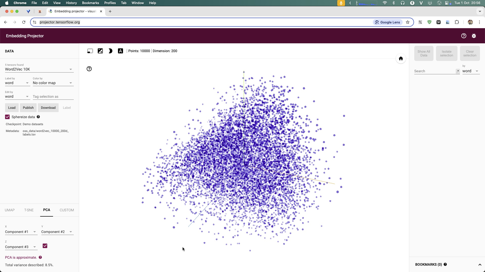

# Train với TensorFlow / Keras

> Cùng bài classifier, nhưng làm bằng TensorFlow (API Keras): định nghĩa model, `compile`, rồi `fit` qua nhiều epoch. Ngắn gọn hơn PyTorch nhờ vòng lặp training được gói sẵn.

## Vì sao quan trọng

TensorFlow (qua Keras) là lối train "khai báo": bạn mô tả model và cấu hình, framework lo phần lặp epoch. Đối chiếu với [PyTorch](./pytorch-training.md) (tự viết vòng lặp) giúp thấy rõ *cùng một ý tưởng học* nhưng hai phong cách API — và bạn chọn cái nào tùy dự án.

## Khung xương

```python
model = keras.Sequential([
    keras.layers.Dense(64, activation="relu"),
    keras.layers.Dense(NUM_CLASSES, activation="softmax"),
])
model.compile(optimizer="adam",
              loss="sparse_categorical_crossentropy",
              metrics=["accuracy"])
model.fit(x_train, y_train, epochs=EPOCHS, validation_data=(x_val, y_val))
```

## Ý chính

- **`compile` = khai báo cách học:** chọn optimizer, loss (softmax + cross-entropy cho phân loại), metric theo dõi.
- **`fit` = chạy training:** framework tự lặp epoch/batch, tự backprop — không cần viết `backward()`/`step()` như PyTorch.
- **Theo dõi bằng metrics:** `accuracy`, `val_loss` in ra mỗi epoch; `val_loss` bắt đầu tăng lại = dấu hiệu overfitting.
- **Callbacks:** `EarlyStopping`, `ModelCheckpoint` giúp dừng đúng lúc và lưu model tốt nhất.
- **TensorBoard & Projector:** xem đường loss, và chiếu embedding xuống 3D để kiểm tra ([embedding.md](./embedding.md)).

## Hình minh họa




## Trong pipeline

```
dataset → model (Keras) → compile → fit (epochs) → checkpoint
```

Cùng đích với [pytorch-training.md](./pytorch-training.md), phục vụ [classification.md](./classification.md).

## Tham khảo

- [TensorFlow — Basic classification](https://www.tensorflow.org/tutorials/keras/classification)
- [Keras API](https://keras.io/api/)

## Related

- [classification.md](./classification.md), [pytorch-training.md](./pytorch-training.md)
- [train-gpu.md](./train-gpu.md), [embedding.md](./embedding.md)
