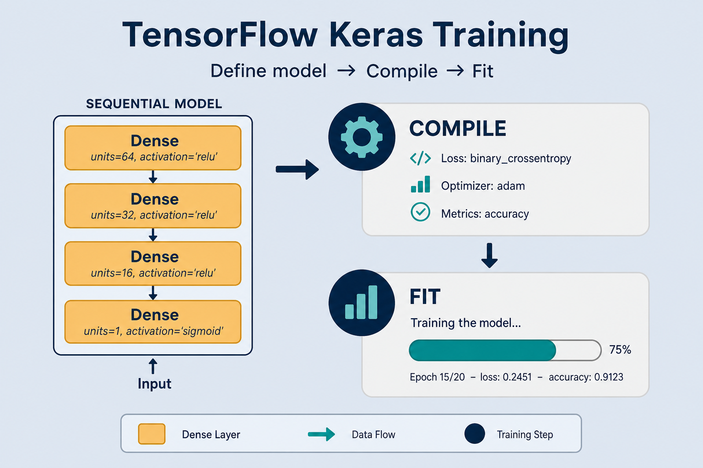

# Train with TensorFlow / Keras

> Same classifier lesson, but with TensorFlow (Keras API): define the model, `compile`, then `fit` over many epochs. More concise than PyTorch thanks to the built-in training loop. Everyday metaphor: you write the recipe (`compile`); the kitchen runs it (`fit`).

## Why it matters

TensorFlow (via Keras) is **declarative** training: you describe the model and settings, the framework runs the epoch loop. Contrasting with [PyTorch](./pytorch-training.md) (where you write the loop yourself) shows the same learning idea in two API styles — pick the one that fits the project.

Keras is especially handy for quick softmax-regression experiments and for the Embedding Projector, which makes vector space visible in 3D while you train ([embedding.md](./embedding.md)).

## Key ideas

- **`compile` = declare how to learn:** pick optimizer, loss (softmax + cross-entropy for multi-class), and metrics to track (`accuracy`, etc.). Example: `optimizer=keras.optimizers.Adam(1e-3)`, `loss="sparse_categorical_crossentropy"`, `metrics=["accuracy"]`.
- **`fit` = run training:** the framework handles epoch/batch iteration and backprop — no manual `backward()`/`step()` like PyTorch. Default `batch_size=32` if you pass NumPy arrays; override explicitly for memory control.
- **Monitor with metrics:** `accuracy` and `val_loss` print each epoch; rising `val_loss` while train loss falls → overfitting. Watch the Keras progress bar: `loss: 0.42 - accuracy: 0.85 - val_loss: 0.51 - val_accuracy: 0.80`.
- **Callbacks:** `EarlyStopping(patience=3, restore_best_weights=True)` stops when val stops improving; `ModelCheckpoint("best.keras", save_best_only=True)` saves the best weights automatically. `ReduceLROnPlateau` halves LR when val plateaus.
- **TensorBoard and Projector:** plot loss curves and project embeddings into 3D to inspect clusters and outliers. Hook with `keras.callbacks.TensorBoard(log_dir="./logs")`.
- **Same math as PyTorch:** under the hood it is still forward → loss → gradients → weight update. Only the API shape differs. Functional/`tf.GradientTape` exists when you need a custom loop.
- **Loss name must match label encoding:** integer class IDs → `sparse_categorical_crossentropy`; one-hot `[B, C]` → `categorical_crossentropy`; binary 0/1 → `binary_crossentropy` (often with a single sigmoid unit).

## Skeleton

```python
model = keras.Sequential([
    keras.layers.Dense(64, activation="relu"),
    keras.layers.Dense(NUM_CLASSES, activation="softmax"),
])
model.compile(
    optimizer="adam",
    loss="sparse_categorical_crossentropy",
    metrics=["accuracy"],
)
model.fit(
    x_train, y_train,
    epochs=EPOCHS,
    validation_data=(x_val, y_val),
    callbacks=[
        keras.callbacks.EarlyStopping(patience=3, restore_best_weights=True),
        keras.callbacks.ModelCheckpoint("best.keras", save_best_only=True),
    ],
)
```

## Worked example (intuition)

You stack a small dense net ending in `softmax` with `NUM_CLASSES` units. After `compile`, each `fit` epoch shuffles batches, computes cross-entropy against integer labels, and updates weights. When `val_loss` bottoms out, EarlyStopping restores that checkpoint — ready for inference.

Numeric sketch: 8 000 train / 2 000 val reviews, `batch_size=64` → 125 steps/epoch. Epoch 1: `loss≈1.05`, `val_loss≈0.72`. Epoch 4: `loss≈0.28`, `val_loss≈0.41` (best). Epoch 7: `loss≈0.12`, `val_loss≈0.55` — overfit. With `patience=3` and `restore_best_weights=True`, Keras rolls back to the epoch-4 weights instead of keeping the overfit epoch-7 state.

## Common pitfalls

- **`categorical` vs `sparse_categorical`** — one-hot labels need `categorical_crossentropy`; integer labels need `sparse_*`. Mixing them silently fails or errors.
- **Forgot validation_data** — you only see train accuracy and miss overfitting.
- **No EarlyStopping** — you keep the last epoch, which may be worse than an earlier one.
- **Projector without labels** — hard to interpret; color points by class when possible.
- **Softmax + `from_logits` confusion** — if the last layer already has `activation="softmax"`, use plain CE string losses; if the last layer is linear, prefer `from_logits=True` losses for better numerical stability.

## Illustrations





## Deeper dive

- **`compile` wires the training step graph.** Optimizer + loss + metrics are fixed at compile time (unless you recompile). Changing LR mid-run: either pass a `LearningRateScheduler` / `ReduceLROnPlateau`, or set `model.optimizer.learning_rate.assign(new_lr)`.
- **Sparse vs categorical — shapes.** Labels shape `[B]` ints → sparse CE. Labels shape `[B, C]` floats → categorical CE. Wrong pairing: cryptic shape errors or nonsense loss (~ tens instead of ~1). Quick check: `y_train.ndim` and `y_train.max()`.
- **`from_logits=True` vs softmax activation.** Prefer linear last layer + `SparseCategoricalCrossentropy(from_logits=True)` for stability (softmax + log combined). Mini comparison: softmax-in-model is convenient for `model.predict` probs; logits + `from_logits` is safer for training — many production setups train on logits and apply softmax only at serve time.
- **Callbacks that change outcomes.** `EarlyStopping(monitor="val_loss", patience=3)` vs `monitor="val_accuracy"`. On imbalanced data, accuracy can plateau while CE still improves rare classes — monitor the metric you care about. `ModelCheckpoint` with `save_best_only=True` pairs with EarlyStopping’s `restore_best_weights`.
- **`tf.data` beats giant NumPy.** `ds = tf.data.Dataset.from_tensor_slices((x, y)).shuffle(10_000).batch(64).prefetch(tf.data.AUTOTUNE)` keeps the GPU fed. Failure mode: feeding full `x_train` that doesn’t fit RAM, or no `prefetch` → GPU idle between steps.
- **Custom training with `GradientTape`.** When `fit` is too rigid: `with tf.GradientTape() as tape: loss = ...; grads = tape.gradient(loss, model.trainable_weights); opt.apply_gradients(zip(grads, model.trainable_weights))`. Same four steps as PyTorch, TF-flavored.
- **Keras vs PyTorch choice.** Keras `fit`: fastest path to a baseline + TensorBoard. PyTorch loop: research flexibility, HF `Trainer` ecosystem. Same CE math; different knobs and error messages.

## Decision guide

| Situation | Prefer | Avoid / why |
|-----------|--------|-------------|
| Quick multi-class baseline on tabular/text features | `Sequential` + `fit` + EarlyStopping | Hand-rolled `GradientTape` before you need it |
| Integer labels `0..C-1` | `sparse_categorical_crossentropy` | `categorical_*` without one-hot — shape/loss bugs |
| One-hot labels already prepared | `categorical_crossentropy` | Sparse loss — wrong assumption on rank |
| Val loss rising after epoch 5 | EarlyStopping + restore best + Checkpoint | Running fixed 50 epochs “just in case” |
| Need non-standard loss / multi-optimizer | `GradientTape` custom loop (or PyTorch) | Stretching `fit` with opaque callback hacks |
| Embedding debugging / teaching | TensorBoard Projector colored by class | Projector with unlabeled gray clouds |

## Pipeline

```
dataset → model (Keras) → compile → fit (epochs) → checkpoint
```

Same target as [pytorch-training.md](./pytorch-training.md), serving [classification.md](./classification.md).

## Slides & demo

| | Link |
|--|------|
| Slides | [slides/tensorflow-training](../slides/tensorflow-training/index.html) |

## References

- [TensorFlow — Basic classification](https://www.tensorflow.org/tutorials/keras/classification)
- [Keras API](https://keras.io/api/)

## Related

- [classification.md](./classification.md), [pytorch-training.md](./pytorch-training.md)
- [train-gpu.md](./train-gpu.md), [embedding.md](./embedding.md)
