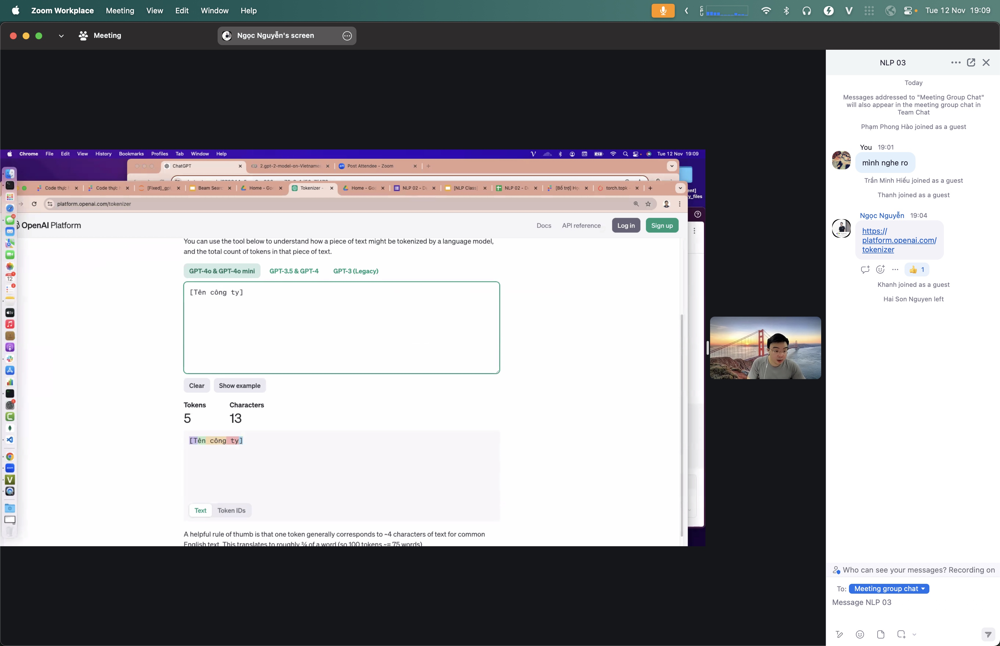
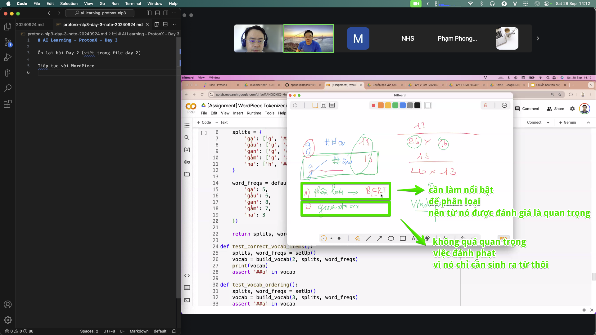
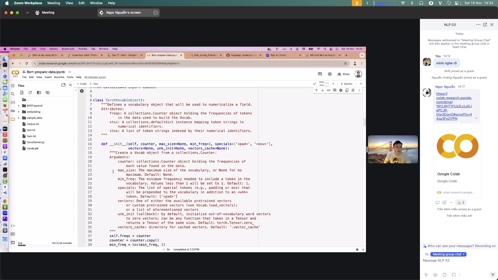

# Tokenize

> Machines do not read words — they read numbers. Tokenization splits text into small pieces (tokens), then maps each piece to a numeric ID.

## Why it matters

Every language model takes a sequence of numbers as input. Before embedding, attention, or classification can run, text must become a sequence of IDs. If tokenization is wrong, every downstream step gets wrong input. The tokenizer is the gateway to the whole pipeline.

## Key ideas

- **Three cut levels:**
  - *Word-level:* `"hello world"` → `["hello", "world"]`. Simple, but unknown words are a problem.
  - *Subword:* `"helloo"` → `["hello", "o"]`. Builds unseen words from known pieces — the most common approach today.
  - *Character:* `"hello"` → `["h","e","l","l","o"]`. Never stuck, but sequences get very long.
- **Vocabulary:** a fixed set of tokens the model knows; each token maps to one ID. Example: `hello → 5021`.
- **BPE vs WordPiece:** two ways to build a subword vocabulary. Both merge frequent pairs; they differ in merge criteria. GPT uses BPE; BERT uses WordPiece.
- **Rough rule:** one token ≈ four English characters — model cost is counted in tokens, not characters.
- **Wrong tokenizer = wrong everything:** train with one tokenizer, run with another → IDs mismatch → the model misreads input completely.

## Illustrations







## Pipeline

```
text → [tokenize] → IDs → embedding → attention → … → softmax
```

Token IDs feed [embedding.md](./embedding.md); from there the path goes to attention, classification, and RAG.

## Slides & demo

| | Link |
|--|------|
| Slides | [slides/tokenize](../slides/tokenize/index.html) |
| Working app | [demos/tokenize/app](../demos/tokenize/app/index.html) |

## References

- Hugging Face — [Tokenizers summary](https://huggingface.co/docs/transformers/tokenizer_summary)
- Sennrich et al. 2016 — [Neural Machine Translation of Rare Words with Subword Units (BPE)](https://arxiv.org/abs/1508.07909)

## Related

- [embedding.md](./embedding.md), [05-demo-text.md](./05-demo-text.md)
