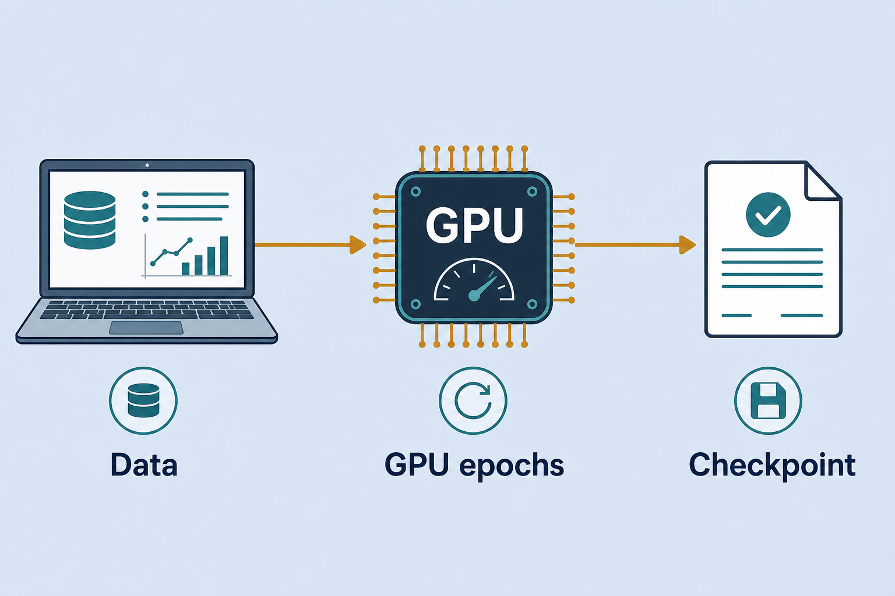
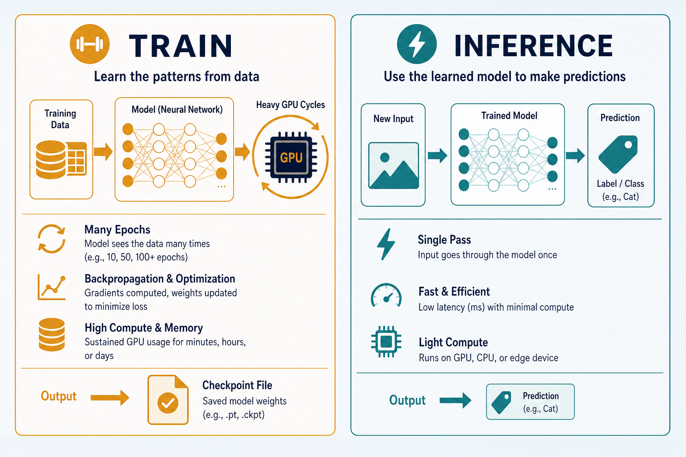
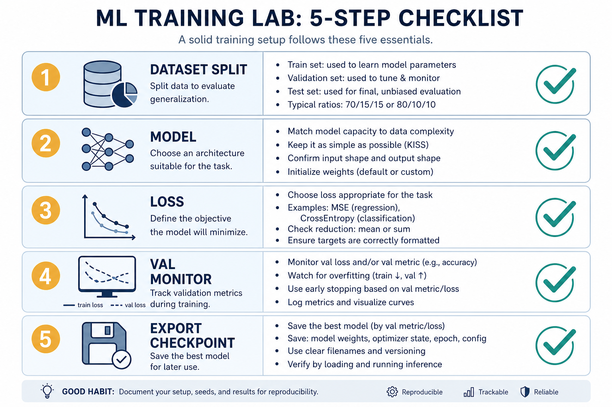

# Train · PyTorch / TensorFlow · GPU Notebooks

> Where models *actually learn*: data from Hugging Face / Kaggle, code in PyTorch or TensorFlow, many epochs on a GPU (Colab/cloud) until good enough, then export weights. Everyday metaphor: the gym (GPU) is where muscles (weights) grow; the phone app (browser demo) only shows the flex.

## Why it matters

Lab demos illustrate inference only. To get a model you can plug in, you must train somewhere with a GPU. This note collects the practical stack — which tools, where data lives, where to run — so you do not rebuild the checklist every time.

## Key ideas

- **Two layers of work:**

  | Layer | Job | Output |
  |-------|-----|--------|
  | **Training** | HF/Kaggle → notebook/endpoint → many GPU epochs | checkpoint |
  | **Inference** | load model → predict | label / action |

  See [06-train-infer.md](./06-train-infer.md) for the two-phase mental model. Training owns *optimizer state*, *data pipelines*, and *eval loops*; inference owns *forward pass only*. Mixing them in one mental bucket is why people try to “train in the browser.”

- **Stack used in practice:**
  - **PyTorch** — flexible; most training code in the lab ([pytorch-training.md](./pytorch-training.md)). Explicit `loss.backward()` / `optimizer.step()` makes debugging shapes and gradients easier.
  - **TensorFlow** — softmax regression and Embedding Projector for visualizing vectors ([tensorflow-training.md](./tensorflow-training.md)). Keras `fit()` is fine for small classifiers; use TF when the notebook or Projector path already exists.
  - **Data:** Hugging Face Datasets and Kaggle — pre-labeled, ready to download. Prefer a Hub card with documented splits over scraping your own labels for teaching demos.
  - **GPU online:** Google Colab / Kaggle / cloud notebooks — train to ~95%+ accuracy when the task allows, then export. Free tiers are enough for MiniLM / small CNN; large full fine-tunes need paid GPU or LoRA.

- **Short workflow (with concrete gates):**

  ```
  pick dataset (HF/Kaggle) → write notebook (PyTorch/TF) → train on GPU
  → watch train + val loss/accuracy every epoch → early-stop or pick best val ckpt
  → export checkpoint (state_dict / SavedModel / ONNX) → plug into demo (inference)
  ```

  Gate before GPU: one CPU batch that prints shapes and a finite loss. Gate before export: val metrics stable for 2–3 epochs and a confusion matrix that isn’t “always majority class.”

- **In AI Journey:** browser demos show the flow; they do **not** replace GPU training. Train in a notebook / Kaggle / Colab, then embed weights in UI demos (car-nn, sentiment…). The demo’s job is latency and UX; the notebook’s job is learning.

- **What “good enough” means:** for teaching demos, stable val accuracy and a sane confusion matrix beat chasing 0.1% leaderboard gains. Ship the **best validation** checkpoint, not the last epoch. Log seed, dataset revision, and learning rate so you can reproduce the export.

- **Hardware reality check:** batch size is limited by VRAM; if you OOM, cut batch size, use gradient accumulation, or switch to a smaller backbone / LoRA. Mixed precision (`torch.cuda.amp` / TF mixed precision) often doubles effective throughput with little accuracy cost on modern GPUs.

## Worked example (intuition)

Sentiment three-class task (neg / neu / pos):

1. **Data:** `load_dataset(...)` from the Hub (or a Kaggle CSV with a clean label column). Keep an 80/10/10 train/val/test split; do not peek at test while tuning.
2. **Model:** fine-tune MiniLM or a small `AutoModelForSequenceClassification` head — not a 70B chat model. Freeze the encoder for a few epochs if labels are scarce, then unfreeze lightly.
3. **Train:** Kaggle/Colab GPU, 3–5 epochs, AdamW, batch 16–32, watch **val** accuracy + F1. Save `best.pt` whenever val improves.
4. **Export:** `torch.save(model.state_dict(), ...)` (or ONNX if the demo needs it). Copy the file into the sentiment demo assets.
5. **Infer:** demo loads weights once at startup; each click is a forward pass only. Users never wait for training — you already paid that cost once in the notebook.

If val F1 stalls below ~0.7 while train accuracy soars, stop: you are overfitting or the label set is noisy — fix data before burning more GPU hours.

## Common pitfalls

- **Training in the browser demo** — demos are for inference; don’t expect on-device epoch loops.
- **No validation split** — you ship an overfit checkpoint.
- **Forgetting to export** — notebook session ends, weights gone.
- **GPU quota waste** — debug shapes on CPU/small data first.
- **Exporting the last epoch** — prefer best-val; last epoch often overfits.

## Illustrations






## Deeper dive

- **VRAM budget before you click Run:** estimate roughly `params × dtype bytes × (activations + optimizer states)`. Adam stores ~2× param memory on top of weights. If a full fine-tune of BERT-base OOMs at batch 32, try batch 8 + grad accumulation 4, or LoRA adapters that train <1% of parameters.
- **Checkpoint hygiene:** save `{epoch, val_metric, state_dict, tokenizer_name, seed}`. Pin the Hub dataset revision (`revision=...`) so “same notebook next month” is actually the same data. Prefer `safetensors` when sharing outside a trusted machine.
- **Train/val leakage is silent:** shuffle *after* splitting by document/user id when reviews or sessions can collide. Stratify multi-class splits so rare labels appear in val. A confusion matrix that looks “too perfect” is a smell.
- **When to stop:** early stopping on val loss with patience 2–3; or a fixed epoch budget for demos once val plateaus. Learning-rate schedules (warmup + cosine) matter more on full fine-tunes than on tiny heads.
- **Framework pick in this lab:** PyTorch for anything you will debug by hand; TensorFlow/Keras when you want Embedding Projector or an existing TF notebook. Don’t dual-maintain both for one demo.
- **Export targets:** browser demos often want a small JSON/`state_dict` or ONNX; Spaces want a Hub repo. Convert once after metrics are good — don’t retrain just to change packaging.
- **Colab/Kaggle gotchas:** session disconnect wipes `/content` — push checkpoints to Drive/Hub every N epochs. Free GPUs throttle; profile one epoch time × planned epochs before overnight runs.
- **Smoke-test gate (mandatory):** one CPU batch printing shapes + finite loss before `.cuda()` / accelerator on. Most “GPU is broken” tickets are shape bugs discovered after burning quota.
- **Demo packaging budget.** After metrics clear the bar, measure artifact size and cold-load time in the target demo. A great notebook checkpoint that is 2 GB fails the lab’s browser/UX constraint — distill or shrink before polish.

## Decision guide

| Situation | Prefer | Avoid / why |
|-----------|--------|-------------|
| Teaching demo, few labels, need a checkpoint this afternoon | Hub pretrained + 2–5 epoch fine-tune on free GPU | Training a Transformer from scratch — weeks of compute for worse results |
| Debugging `RuntimeError: shape mismatch` | CPU, batch size 1–2, `print` shapes before `.cuda()` | Burning GPU quota on broken graphs |
| Val accuracy high, train much higher | Best-val checkpoint + more regularization / less epochs | Shipping last-epoch weights — classic overfit |
| Need vectors for Projector / softmax lab | TensorFlow path already in [tensorflow-training.md](./tensorflow-training.md) | Rewriting the whole stack in PyTorch “for purity” |
| Large model, limited VRAM | LoRA / PEFT or smaller backbone | Full fine-tune of huge models on free Colab |
| Demo must load in browser quickly | Small classifier / MiniLM export | Shipping a multi-GB chat checkpoint into static HTML |



## Case study

Produce weights for the lab sentiment demo (neg / neu / pos) without training in the browser.

- **Inputs:** Hub (or Kaggle) labeled reviews, 80/10/10 split; MiniLM sequence-classification head; Colab/Kaggle GPU session.
- **Steps:** CPU smoke batch → GPU fine-tune 3–5 epochs, AdamW, batch 16–32 → track val F1 + confusion matrix → save `best.pt` on improvement → export into demo assets → browser only runs forward passes.
- **Output:** demo loads once at startup; clicks stay low-latency; notebook holds the reproducible train script + seed + dataset revision.
- **What you'd check:** val F1 not stalled while train accuracy → 99%; best-val not last-epoch; artifact size fit for the demo; GPU disabled while debugging prints.

## Lab checklist

- [ ] Pick a labeled dataset and write down train/val/test sizes
- [ ] Run a 1-batch CPU smoke test (shapes + finite loss)
- [ ] Fine-tune on GPU for a few epochs while logging val metrics
- [ ] Save the best validation checkpoint (not only the final epoch)
- [ ] Export weights + label map into a demo or Hub folder
- [ ] Load the export in an inference-only path and predict on 5 held-out examples
- [ ] Record seed, LR, and dataset revision next to the checkpoint
- [ ] Estimate artifact size / load time against the demo’s constraints

## Pipeline

```
HF/Kaggle data → notebook (PyTorch/TF) → GPU epochs → checkpoint → demo inference
```

## Slides & demo

| | Link |
|--|------|
| Slides | [slides/train-gpu](../slides/train-gpu/index.html) |
| Related demos | [car-nn](../demos/car-nn/app/index.html) · [sentiment](../demos/sentiment/app/index.html) |

## References

- [PyTorch — Training a classifier](https://pytorch.org/tutorials/beginner/blitz/cifar10_tutorial.html)
- [Hugging Face Datasets](https://huggingface.co/docs/datasets/)

## Related

- [06-train-infer.md](./06-train-infer.md) — train vs infer
- [pytorch-training.md](./pytorch-training.md), [tensorflow-training.md](./tensorflow-training.md), [huggingface.md](./huggingface.md), [kaggle.md](./kaggle.md)
- Demo notes: [04-demo-car.md](./04-demo-car.md), [05-demo-text.md](./05-demo-text.md)
