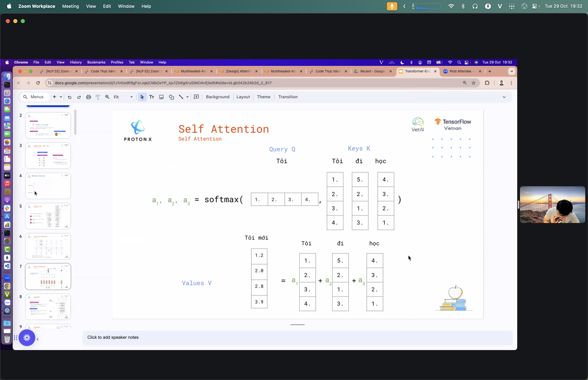
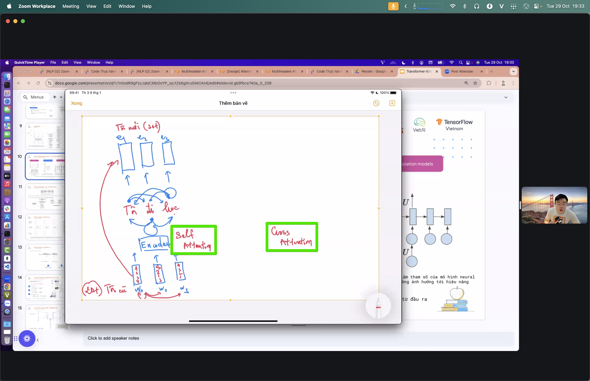
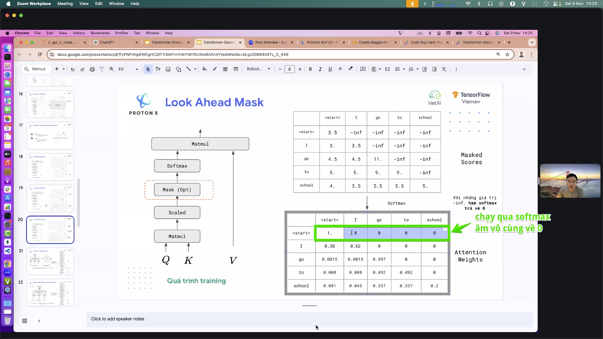
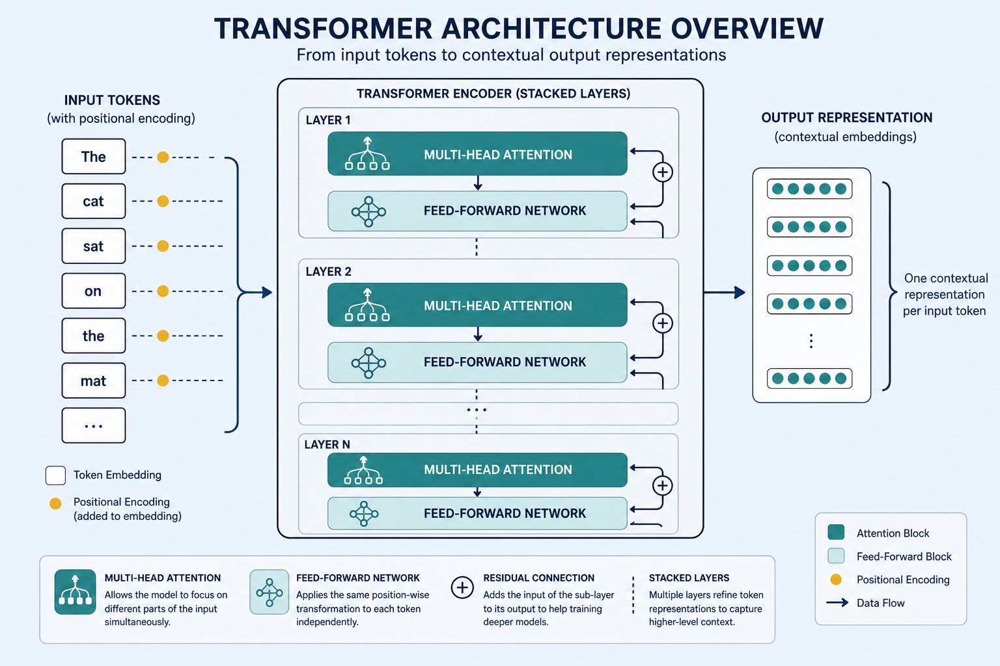
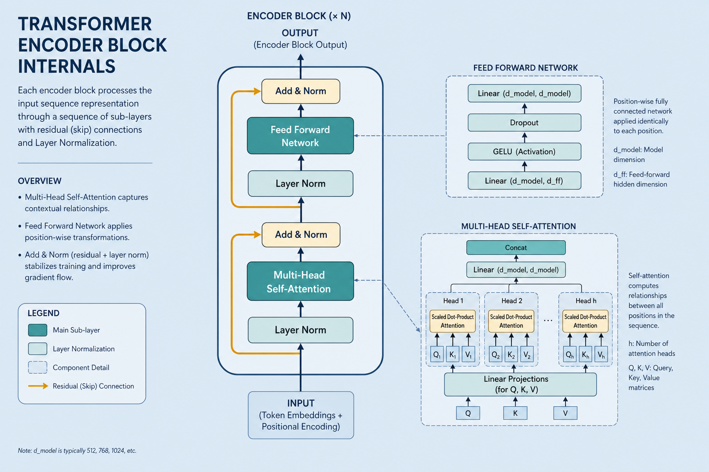
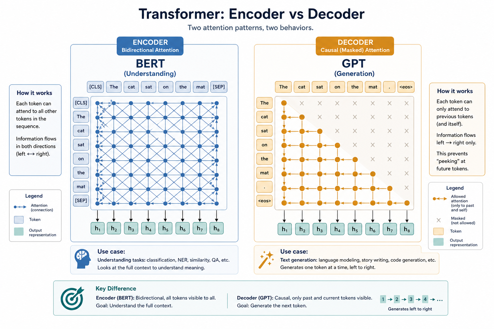

# Transformer — core architecture of LLMs

> Stack many [attention](./attention.md) blocks and process a whole sentence in parallel instead of step by step. The framework behind BERT, GPT, and nearly every modern language model. Everyday metaphor: instead of reading word-by-word with a bookmark, every word glances at every other word at once — then you deepen that glance across many floors of the building.

## Why it matters

Before Transformers, models read sentences sequentially (RNN/LSTM) — slow and prone to forgetting early context. The Transformer (2017, “Attention Is All You Need”) drops sequential processing: every word attends to every other word at once → faster GPU training and better long-range links. That pivot opened the LLM era.

Everything in this lab that feels “modern” — chat models, embeddings from BERT-like encoders, cross-attention in translation — sits inside this frame.

## Key ideas

- **Stacked attention blocks:** each layer has multi-head [attention](./attention.md) plus a feed-forward network (typically two linear layers with a nonlinearity, expanding to ~4× model width then projecting back). Stack many layers for increasingly abstract representations (syntax → entities → discourse). A typical BERT-base has **12 layers × 768 hidden × 12 heads**; GPT-class chat models often push into tens or hundreds of layers and billions of parameters.
- **Positional encoding:** parallel processing has no built-in order — inject position info so the model knows word sequence. Without it, “dog bites man” ≈ “man bites dog.”
  - *Sinusoidal* (original paper): fixed `sin`/`cos` functions of position and dimension — extrapolates somewhat to longer sequences.
  - *Learned absolute* (early BERT): a trainable embedding table per position index (capped by max length, e.g. 512).
  - *Relative / RoPE / ALiBi* (modern LLMs): encode *distance* between tokens rather than absolute index — better long-context behavior.
- **Encoder / decoder / both:**
  - *Encoder* (BERT, RoBERTa): bidirectional self-attention over the full sequence → good for [classification](./classification.md) and sentence embeddings. Masked LM pretraining fills blanks from left *and* right context.
  - *Decoder* (GPT, LLaMA): generate left to right with **causal masking** (token *i* may only attend to ≤ *i*) → good for chat and completion. Next-token prediction is the training objective.
  - *Encoder-decoder* (T5, BART, original Transformer): encoder reads the source; decoder generates the target and uses **cross-attention** (queries from decoder, keys/values from encoder) — classic for translation and summarization.
- **Residual + layer norm:** each sublayer is wrapped as `x + Sublayer(Norm(x))` (Pre-LN is common today). Skip connections keep gradients flowing through deep stacks; layer norm stabilizes activation scales.
- **Multi-head = parallel views:** split `d_model` across *h* heads (e.g. 768 / 12 = 64 dims per head). One head may track grammar, another coreference — outputs concatenate and project with `W_O`.
- **Complexity:** full self-attention is **O(n² · d)** in sequence length *n* and width *d*. Doubling context roughly quadruples attention compute/memory — why long docs need chunking, sliding windows, or sparse/linear attention variants ([train-gpu.md](./train-gpu.md)).
- **Parallel = fast training:** no step-by-step RNN dependency across time → full sequence batched on GPU. Autoregressive *inference* is still sequential token-by-token (unless speculative decoding / parallel drafts).

## Worked example (intuition)

Sentence: `"The cat sat on the mat."` (6 tokens after simple whitespace split; real BPE might be similar or slightly different.)

1. **Embed:** each token ID → vector of size `d_model` (e.g. 768) + positional encoding of the same size → matrix `X ∈ ℝ^{6×768}`.
2. **Layer 1 self-attention (encoder):** for query `"sat"`, compute scores against all keys. After [softmax](./softmax.md), `"sat"` might put ~0.35 on `"cat"` (subject), ~0.25 on `"mat"` (location), and smaller mass on function words. Multi-head repeats this with different projections.
3. **Feed-forward:** each position independently: `FFN(x) = W₂ · GELU(W₁ x)` — mixes features *within* the token’s new context-aware vector.
4. **After N layers:** representations are contextual. A **classification head** (BERT-style) often reads the `[CLS]` vector (or mean pool) → logits over labels. A **LM head** (GPT-style) reads the *last* position → vocabulary logits for the next token (softmax over ~50k–100k+ tokens).
5. **Decoder contrast:** if this were causal GPT, when predicting the word after `"sat"`, attention to `"mat"` would be **masked out** — the future must not leak.

## Common pitfalls

- **Confusing encoder vs decoder tasks** — don’t expect a pure encoder to generate fluent chat; don’t expect a causal decoder to be the best frozen sentence embedder without pooling tricks ([sentence-transformers.md](./sentence-transformers.md)).
- **Ignoring context length** — attention is O(n²); stuffing a 50-page PDF into one forward pass OOMs or truncates silently.
- **Dropping positional info when hacking** — broken order sensitivity; bag-of-embeddings behavior.
- **Mixing Pre-LN vs Post-LN assumptions** — copying layer order from one paper into another codebase can destabilize training.
- **Assuming bidirectional = always better** — for open-ended generation, causal decoders win; bidirectional encoders shine at understanding fixed text.

## Illustrations













## Deeper dive

- **Scaled dot-product attention:** `Attention(Q,K,V) = softmax(QKᵀ / √d_k) V`. The `√d_k` scale (e.g. √64 ≈ 8) keeps logits from saturating softmax when dimensions grow — without it, gradients vanish.
- **Causal mask mechanics:** before softmax, set future positions to `−∞` (or a large negative). One bug (off-by-one in the mask) leaks the next token during training and inflates perplexity metrics while breaking real generation.
- **Cross-attention shapes:** decoder queries are `T_tgt × d`; encoder keys/values are `T_src × d`. Translation quality collapses if source encodings are truncated or misaligned with the tokenizer.
- **KV cache (decoder inference):** reuse past keys/values so each new token attends in **O(n)** to history instead of recomputing the full triangle — memory grows with context; this is the main serving bottleneck for long chats.
- **Parameter intuition:** attention projections are `4 · d²` per layer (Q,K,V,O); FFN is often `8 · d²` (up and down). FFN usually dominates parameter count; attention dominates **memory** at long *n*.
- **Failure mode — context stuffing:** past the trained context window, quality drops sharply unless the model uses RoPE scaling / YaRN / sliding window. Silent truncation of the *beginning* of a prompt is a common production bug.
- **Encoder-vs-decoder choice API-wise:** Hugging Face `AutoModel` (encoder body), `AutoModelForMaskedLM`, `AutoModelForCausalLM`, `AutoModelForSeq2SeqLM` — picking the wrong head class is a frequent beginner error.

## Decision guide

| Situation | Prefer | Avoid / why |
|-----------|--------|-------------|
| Classify or embed a whole sentence/doc | Encoder (BERT-family) or Sentence-BERT on top | Pure causal decoder without pooling — not trained for symmetric similarity |
| Chat, code completion, open generation | Causal decoder (GPT-family) | Bidirectional encoder alone — cannot emit fluent left-to-right text |
| Translation / summarization seq2seq | Encoder–decoder (T5, BART) or instruction-tuned decoder with careful prompting | Encoder-only — no generative pathway |
| Need >4k–8k tokens of context | Models with RoPE/ALiBi + long-context training; or chunk + retrieve | Naively extending sinusoidal absolute positions — poor extrapolation |
| On-device / low latency classify | DistilBERT / MiniLM-class encoders | Full 70B decoder “just to label sentiment” — cost without benefit |
| Debugging “model ignores word order” | Check positional encodings / RoPE applied | Assuming attention alone encodes position — it does not |

## Pipeline

```
tokens → embedding + positional → [N × (multi-head attention + feed-forward)] → representation
       → head: classification / generation
```

The Transformer is the “house frame” wrapping [attention.md](./attention.md), [embedding.md](./embedding.md), and [softmax.md](./softmax.md) into one complete model.

## Slides & demo

| | Link |
|--|------|
| Slides | [slides/transformer](../slides/transformer/index.html) |
| Related demo | [demos/attention](../demos/attention/app/index.html) |

## References

- Vaswani et al. 2017 — [Attention Is All You Need](https://arxiv.org/abs/1706.03762)
- Jay Alammar — [The Illustrated Transformer](https://jalammar.github.io/illustrated-transformer/)

## Related

- [attention.md](./attention.md), [embedding.md](./embedding.md), [softmax.md](./softmax.md)
- [huggingface.md](./huggingface.md) — pretrained Transformer models
