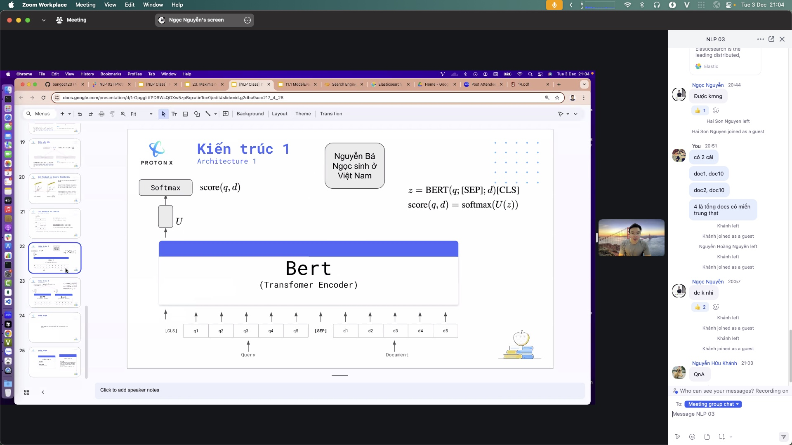
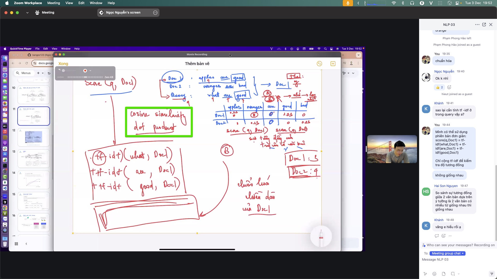
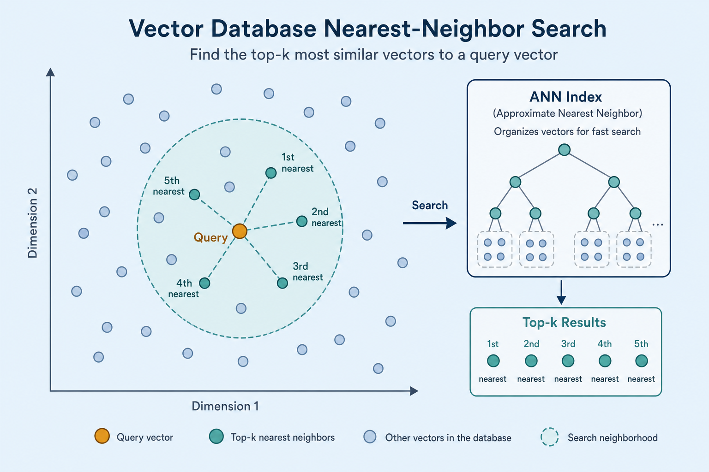
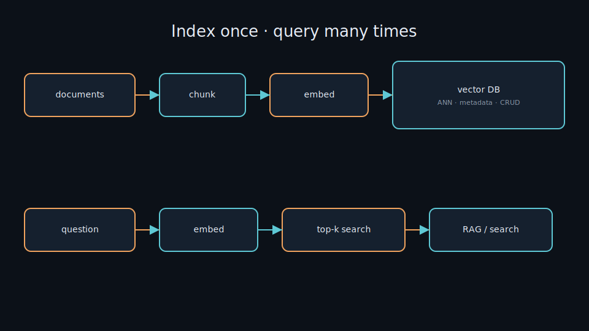
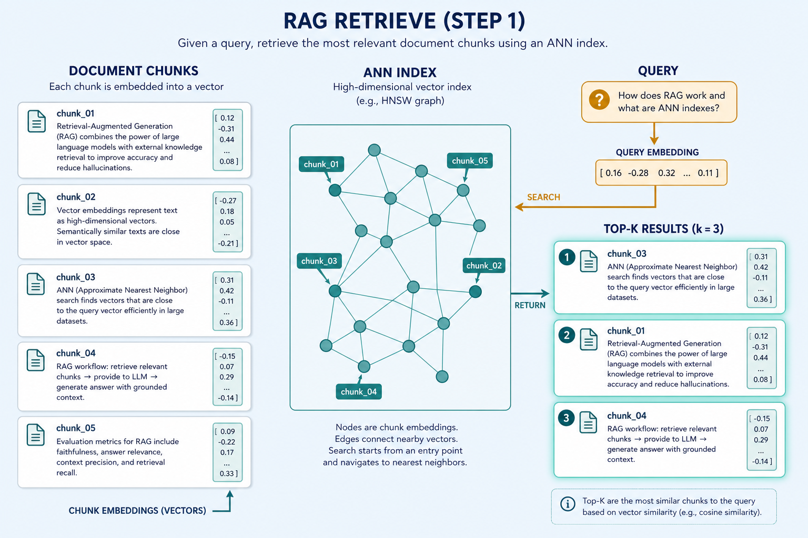
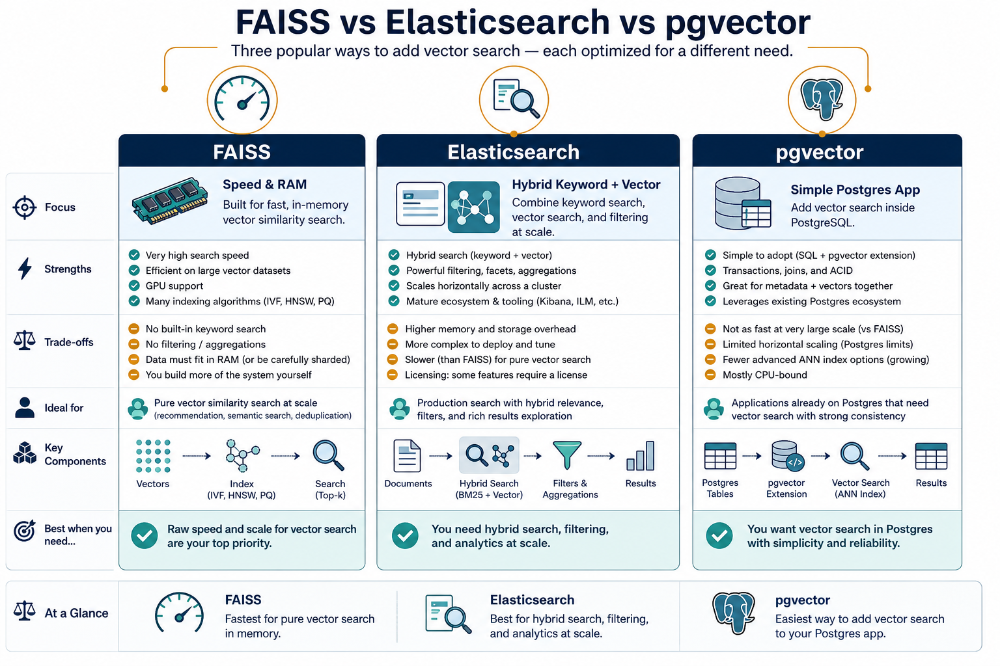

# Vector database

> Store millions of embedding vectors and answer “which vectors are closest to this one?” in milliseconds. The infrastructure under RAG and semantic search. Everyday metaphor: a library that shelves books by *meaning coordinates*, not only by title keywords — and can point to the nearest shelves instantly.

## Why it matters

[Embedding](./embedding.md) turns everything into vectors — but where do you store them, and how do you search? Scanning every vector one by one (brute force) is too slow at scale. A vector database stores vectors with their source data and finds top-k nearest neighbors fast via approximate indexes. Without it, [RAG](./rag.md) and [semantic search](./semantic-search.md) cannot run at real-world scale.

## Key ideas

- **Core problem — nearest neighbor:** given query `q ∈ ℝ^d`, find the k closest vectors by cosine, dot product, or L2 ([embedding.md](./embedding.md)). Brute force is **O(N · d)** per query — fine for 10k rows, painful at 10M+.
- **ANN instead of brute force:** approximate nearest neighbor indexes trade a little recall for large speedups:
  - **HNSW** (Hierarchical Navigable Small World): multi-layer graph; search walks edges toward the query. Strong default recall/latency; RAM-heavy (graph edges + vectors). Tunables: `M` (connections per node), `efConstruction` / `efSearch`.
  - **IVF** (Inverted File): cluster vectors into `nlist` coarse centroids (k-means); at query time probe only `nprobe` lists. Good for large N on disk/RAM; needs a training pass on representative vectors. Often paired with **PQ** (product quantization) to compress vectors.
  - **Flat / brute force:** exact search — use for small N or as a recall baseline when tuning ANN.
- **More than vectors:** each record carries *metadata* (source, date, tags, ACL) for **pre-filtering** or **post-filtering**. Production systems need CRUD, backups, and idempotent upserts when documents change.
- **Chunking first:** rarely embed a whole book as one vector — split into passages (~200–400 tokens is a common RAG starting point), embed each, store `{chunk_text, vector, source, offsets}` together. Too-large chunks blur topics; too-small chunks lose context.
- **Common choices:**
  - *FAISS* — in-memory (or memory-mapped), very fast, excellent for experiments and custom IVF/HNSW/PQ recipes; you own persistence and CRUD.
  - *Elasticsearch / OpenSearch kNN* — HNSW (or other) beside BM25 inverted index — natural fit for hybrid search ([semantic-search.md](./semantic-search.md)).
  - *pgvector* — Postgres `vector` type + IVFFlat/HNSW; great when relational data already lives in Postgres.
  - *Chroma / Qdrant / Milvus / Weaviate* — purpose-built stores with collections, filters, and ops features at different scales.
- **Pick by need:** scale + hybrid keyword + CRUD → Elastic; pure in-RAM research speed → FAISS; app already on Postgres → pgvector; local demo → Chroma.
- **Metric must match training:** if embeddings were trained with cosine, search with cosine (or **L2-normalize then inner product**). Wrong metric → systematically wrong ranking even when ANN recall looks “healthy.”

## Worked example (intuition)

1. Split docs into ~200–400 token chunks (e.g. 8,000 chunks from a wiki).
2. `encode()` each chunk with [sentence-transformers](./sentence-transformers.md) → `8000 × 384` float32 (~12 MB vectors).
3. Upsert `(vector, text, source, date)` into the DB. For FAISS HNSW: build once; for Elastic: index docs with a `dense_vector` field.
4. On question: embed question (~1–5 ms on GPU for MiniLM) → ANN top-8 with `efSearch` high enough for stable recall → optional metadata filter (`date >= 2024-01-01`) → hand chunks to the LLM ([rag.md](./rag.md)).
5. **Metric check:** if you indexed raw MiniLM vectors but query with L2 while the model was evaluated with cosine, near-duplicates with large norms can outrank true paraphrases — normalize at write *and* read, or set the index space to cosine explicitly.

## Common pitfalls

- **Stale index** — docs changed but vectors not re-embedded; RAG cites ghost content.
- **Dimension / model mismatch** — query encoder ≠ index encoder (384 vs 768 is the obvious crash; same-`d` different models is the silent killer).
- **No metadata filters** — retrieving irrelevant years/sources/tenants.
- **k too small or too large** — miss context, or drown the LLM in noise (and blow the context budget).
- **ANN under-tuned** — low `efSearch` / `nprobe` looks fast in load tests but drops Recall@10 in eval.
- **Filter-then-ANN vs ANN-then-filter** — aggressive prefilters can empty candidate sets; postfilters can return fewer than k hits.

## Illustrations













## Deeper dive

- **HNSW cost model:** build time and RAM grow with `N · M · d`. Raising `efSearch` from 32 → 128 often lifts recall toward flat-search quality with a roughly linear latency hit — measure Recall@10 on a labeled query set, don’t guess.
- **IVF failure mode:** if `nprobe` is too small, the true neighbor’s coarse cell is never visited → hard misses. If the IVF train set does not match production traffic (e.g. trained on titles, queries are long questions), list assignment quality tanks.
- **PQ compression:** product quantization can shrink vectors 4–16× with some recall loss — attractive at 100M+ vectors; always A/B against float32 on a gold query set before shipping.
- **Metric mismatch examples:** (1) cosine-trained SBERT + L2 search; (2) IP index on unnormalized vectors; (3) Elastic `cosine` vs FAISS `METRIC_INNER_PRODUCT` without normalizing. Symptoms: “demo looked great in Notebook cosine_sim, production ranking feels random.”
- **Latency budget sketch:** embed query 2–20 ms + ANN 1–30 ms + fetch payloads 1–10 ms is a common comfortable band for interactive RAG; p99 spikes usually come from cold caches, huge `k`, or heavy metadata filters.
- **CRUD reality:** deleting a document means deleting *all* its chunk vectors; partial updates need stable `chunk_id`s. Re-embedding after model upgrade means **full reindex**, not a hot swap of one row.
- **Hybrid join:** many stacks run BM25 and HNSW separately then fuse scores (RRF — reciprocal rank fusion). Pure vector DB alone will miss exact SKUs/IDs that keyword search catches.

## Decision guide

| Situation | Prefer | Avoid / why |
|-----------|--------|-------------|
| <50k vectors, prototyping | Flat FAISS / Chroma / pgvector exact | Premature IVF/PQ — complexity without gain |
| Millions of vectors, high recall | HNSW (FAISS/Elastic/Qdrant) with tuned `efSearch` | Tiny `efSearch` “because it’s fast” — silent recall drop |
| Huge N, RAM-constrained | IVF + PQ (FAISS) or disk-oriented engines | Pure in-RAM HNSW of float32 — OOM |
| Need BM25 + vectors + CRUD | Elasticsearch/OpenSearch kNN | FAISS alone — you will reinvent ops and keyword search |
| App data already in Postgres | pgvector (HNSW/IVFFlat) | Extra DB just for vectors unless scale demands it |
| Cosine-trained embeddings | Cosine space, or normalize + IP | L2 on raw SBERT vectors — ranking distortion |

## Pipeline

```
documents → chunk → embedding → [vector database]
question  → embedding → [vector database: top-k search] → RAG / semantic search
```

Vector databases receive vectors from [embedding.md](./embedding.md) / [sentence-transformers.md](./sentence-transformers.md) and supply top-k results to [rag.md](./rag.md) and [semantic-search.md](./semantic-search.md).

## Slides & demo

| | Link |
|--|------|
| Slides | [slides/vector-database](../slides/vector-database/index.html) |
| Related demo | [demos/rag](../demos/rag/app/index.html) |

## References

- [FAISS (Meta)](https://github.com/facebookresearch/faiss)
- [pgvector](https://github.com/pgvector/pgvector) · [Elasticsearch kNN search](https://www.elastic.co/guide/en/elasticsearch/reference/current/knn-search.html)

## Related

- [embedding.md](./embedding.md), [rag.md](./rag.md), [semantic-search.md](./semantic-search.md)
- [sentence-transformers.md](./sentence-transformers.md)
