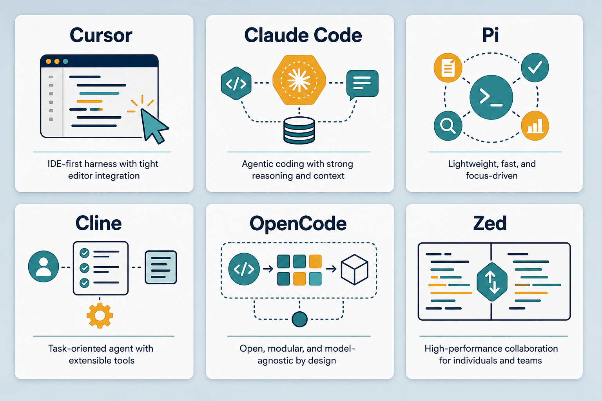

# AI Agents · harness comparison

> **Harness ≠ model.** Harness = orchestration software (UI, tool calling, context, agent loop). Model = the brain plugged in. The same model on different harnesses feels very different. Compare models at [08-model-notes.md](./08-model-notes.md). Everyday metaphor: the same chef in different kitchens — tools, mise en place, and service rhythm change the meal.

## Why it matters

Picking a model is only half the story. The harness decides what context the model sees, which tools it can call, and how it loops until the job is done. Two people with the same model in Cursor vs Claude Code can have opposite experiences — because the harness differs.

Understanding harnesses also explains why skills/rules/MCP feel uneven across clients: loading `~/.agents`, MCP reliability, and agent-loop design are harness features.

## Key ideas

- **Comparison table (personal experience):**

  | Harness | Strengths | Limitations | Feel |
  |---------|-----------|-------------|------|
  | **Cursor** | fast feedback — see results and adjust immediately; Auto vs fixed model; MCP + strong skills | Auto quality can be unpredictable | fastest loop; default `grok-4.5` is cheap with very good quality |
  | **Claude Code** | excellent at clarifying context; handles complex skills/rules well | slower; session limits → wait | solid for hard tasks / many constraints |
  | **Pi** | loads global `~/.agents`; lightweight | smaller ecosystem | same skills as Cursor/Claude, minimal overhead |
  | **Cline / Kilo** | open, customizable; Kilo clones Cline | quality depends on plugged-in model | good for rapid self-directed testing |
  | **OpenCode** | open source, many models | fewer “smart” features than Cursor | test models via OpenRouter |
  | **Zed** | fast editor, compact agent | agent less deep than Cursor/Claude | lightweight coding |

- **Auto vs fixed model:** Cursor Auto is fast but quality varies with routing. Fixed model (e.g. `grok-4.5`) is controllable — in practice often *better than Auto* without burning much budget (token efficiency? routing? worth investigating).

- **What harnesses differ on:**
  - *Context management* — how files get compressed and selected for the prompt.
  - *Tool calling* — MCP, shell, browser — smoothness and reliability.
  - *Agent loop* — self-correction, tests, asking back.
  - *Skills / rules* — loading global know-how from `~/.agents` ([skills-rules.md](./skills-rules.md)).

- **First mate:** orchestrates crew + `agents.md` — an agent that knows what to do and coordinates crewmates. Lab UI: Kun Chen video + repo `kunchenguid/firstmate`.

- **Homes:** `~/.agents/skills` (global skills), `~/work-station/agents-setup` (skill trials), `graphify` (codebase link viz).

## Worked example (intuition)

Same bugfix: “tests fail on CI.” In Cursor with MCP + repo skills, the agent runs tests, reads logs, patches, re-runs. In a thinner harness without reliable shell/MCP, it only *suggests* commands for you to paste. Same brain; different arms.

## Common pitfalls

- **Blaming the model for harness gaps** — missing tools ≠ weak reasoning.
- **Always using Auto** — convenience can hide routing regressions.
- **Skipping AGENTS.md / skills** — every session re-teaches the same project facts.
- **Comparing harnesses on different tasks** — hard refactors favor Claude Code; tight UI loops favor Cursor.

## Illustrations

## Slides & demo

| | Link |
|--|------|
| Slides | [slides/agents](../slides/agents/index.html) |
| MCP demo | [demos/mcp](../demos/mcp/app/index.html) |
| Complexity router | [demos/complexity-router](../demos/complexity-router/app/index.html) |

## References

- [AGENTS.md](https://agents.md/) — standard for declaring agent instructions
- [Cursor docs](https://docs.cursor.com/) · [Claude Code](https://docs.anthropic.com/en/docs/claude-code)

## Related

- [mcp.md](./mcp.md), [skills-rules.md](./skills-rules.md), [08-model-notes.md](./08-model-notes.md)
